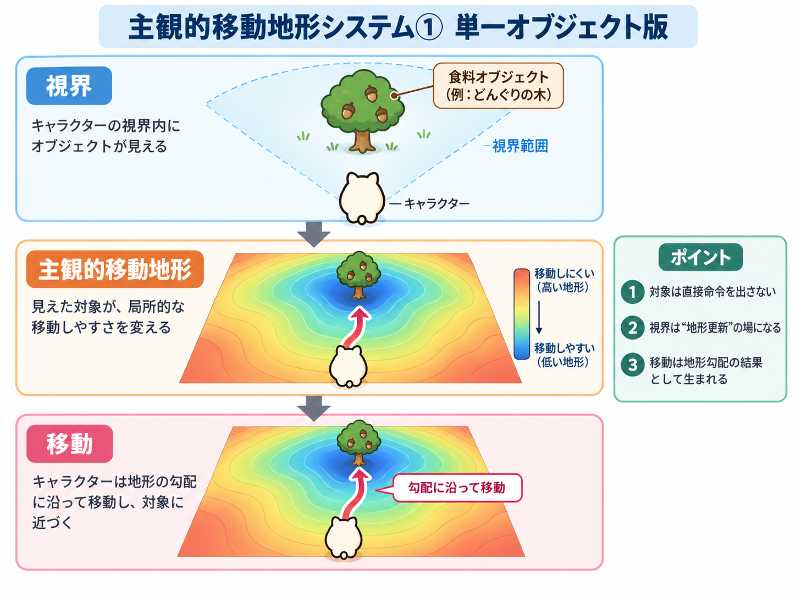
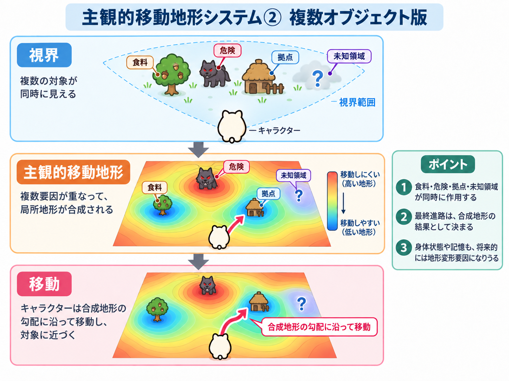
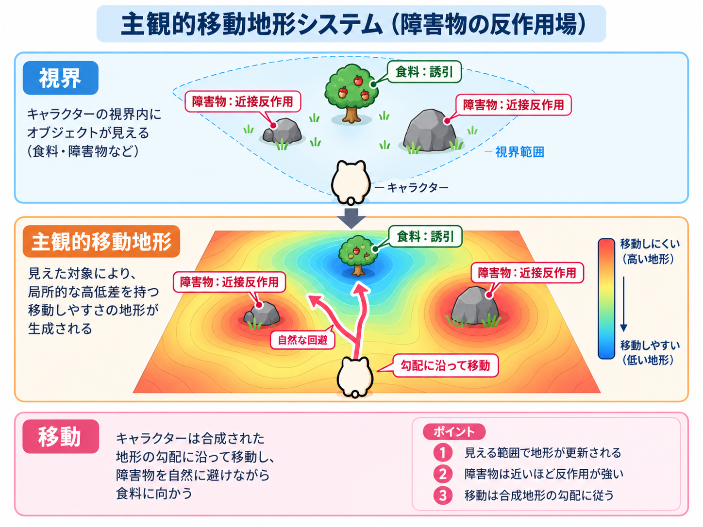

# 図付き・主観的移動地形システム拡張計画書 v0.7

**状態:** DESIGN / IMPLEMENTATION-SYNCED DRAFT\
**対象:** `RDL-Labs/RDL_GameAI_Lab`\
**提供文書の基準:** `main@8fa5920a93df651e7057f733d19d2b5309be9366`\
**提供文書の到達点（照合は下記参照）:**

- L15A Phase 1 pure calculator: **ACCEPTANCE COMPLETE**
- L15A finite opt-in World connection: **ACCEPTANCE COMPLETE**
- movement quality / stability: **IN PROGRESS**
- fatigue / unknown / social relation / concept gravity / scenario contribution: **DESIGN ONLY**

**RDL上の位置:** GameAI-local な行動形成・観測設計。T0 Core primitive の追加ではない。

---

## リポジトリ照合と対話追記（2026-09-28）

本書はユーザー提供v0.7を取り込み、対話で整理した「停止・再観測・興味による寄り道・目的の非参照」を11.5〜11.9へ追記した設計文書。
リポジトリ照合基準は `main@20ed7d2`。提供文書の `8fa5920` 以降の実装を巻き戻さない。
文書更新 `09dc011` 後の対話を11.10〜11.13へ追加した。渦状の停滞、退屈との共通性、反復反応の残存・減衰差を扱う。
`122e4f4` を基準とする次の変更では、Change 2のξ_tieだけを有限実装した。
独立した[契約](../experiment-contracts/LUANTI_L15A_tie_break_contract.md)・[Evidence](../experiment-evidence/LUANTI_L15A_tie_break_evidence.md)を実装範囲の正本とする。

| 範囲 | 照合時点の状態 |
| --- | --- |
| 有限5方向の地形計算・探索接続v1 | 実装・有限な受入完了 |
| 短期方向維持・実旋回後の一歩・旋回打切り | `f63d6a7` の独立mode。[契約](../experiment-contracts/LUANTI_L15A_steering_contract.md)・[Evidence](../experiment-evidence/LUANTI_L15A_steering_evidence.md)。一般的な自然歩行の完成ではない |
| 固定左右バイアス単独 | `20ed7d2` で実装。[契約](../experiment-contracts/LUANTI_L15A_lateral_bias_contract.md)・[Evidence](../experiment-evidence/LUANTI_L15A_lateral_bias_evidence.md)。方向維持との合成は未実装 |
| tie-break perturbation単独 | 有効な近同点のみ、最大3判断・750ms。実Luanti5runの有限受入完了。主比較で移動改善なし |
| conflict_magnitude等の追加診断、三者の合成 | DESIGN ONLY |
| 11.5〜11.9の停止・関心・目的の扱い、身体状態・未知・社会・M_Bの地形投影・集団観測 | DESIGN ONLY |
| 11.10〜11.13の反復反応・減衰差・渦からの切替 | DESIGN ONLY。既存L14Bの感度0や連続確認の規則は変更しない |

`09dc011` / `122e4f4` の対話追記は文書のみだった。後続のξ_tieは別modeとして選択へ作用するが、
観測・判断周期、身体controller、既存の目的優先順位は変えない。
「考える時間」は対話で設計を検討する時間を指す。NPCに固定の待ち時間を追加する合意ではない。
後半のPhase・次作業指示は後続候補として保持し、今回一括実装する指示とは扱わない。
停止条件、興味の形成、目的の保持・再参照、数値予算や期限は、後続の実装契約で固定する。

提供元: `主観的移動地形システム拡張計画書_v0.7.md`。
原ファイルSHA-256: `538175ea8512067859c42697b495fe7e8628b07a07f1674c820e478f6da4da0c`。
原ファイルは変更せず、基準の現状注記、図の参照整理、Markdown改行の整形と対話追記をリポジトリ版へ施した。
既存の[v0.3](RDL_GameAI_Luanti_Subjective_Movement_Terrain_Extension_Plan_v0.3.md)は設計・実装履歴として保持する。

---

## 0. この文書の目的

主観的移動地形システムは、観測結果から直接 `turn / move / wait` を出すのではなく、

```text
有限観測
↓
その個体・その時点の主観的移動地形
↓
局所的な偏り・勾配
↓
有限な身体操作
↓
再観測
```

という中間層を置く。

ここでいう「地形」は World の真の地形ではない。

> **その個体が、その時点で、どちらへ遷移しやすい／しにくいかを局所的に表した合成面**

である。

現行L15Aでは、Food・局所地表・障害物を用いた有限5方向の地形計算と、
既存L14B探索へのopt-in接続まで成立している。

一方で、実World接続では左右旋回の反転・振動が観測されており、
次段階では「地形を増やす」より先に、**対称性・拮抗・停滞・旋回安定性の扱い**を詰める。

---

## 1. 単一オブジェクトによる局所変形



最小構造:

```text
Foodを観測
↓
Food方向に局所的な誘引
↓
その方向が相対的に移動しやすくなる
↓
有限な移動候補が偏る
```

対象が直接 `move` 命令を出すのではない。

対象は地形形成への一つの contribution であり、
最終行動は他の contribution と合成された後に決まる。

---

## 2. 複数オブジェクトの合成



実際の視界には複数の対象が存在する。

概念上:

```text
Food
障害物
危険
拠点
未知
身体状態
relation
...
↓
それぞれ別 provenance の contribution
↓
合成された主観的移動地形
↓
選択
```

一つの「最重要対象」を必ず先に選ぶ構造には限定しない。

---

## 3. 障害物の近接反作用



障害物は単なる collision truth ではなく、
本人が現在観測できた範囲で、近づくほど強くなる局所反作用を形成しうる。

```text
Foodへの誘引
+
障害物への近接反作用
↓
合成
↓
衝突前から軌道が曲がる
```

ただし、

```text
subjective obstacle contribution
!=
World collision truth
```

である。

最終的な身体作用の可否は World 側が決定する。

---

## 4. 現行実装の到達点

### 4.1 Phase 1 pure calculator

現行 `runtime/subjective_movement_terrain.py` は、
身体相対の有限入力から、

```text
-90 / -45 / 0 / +45 / +90 degree
```

の5方向を評価する。

現行成分:

```text
physical
food
obstacle
```

Foodは誘引、障害物は近接反作用、地表差はphysical costとして扱う。

### 4.2 opt-in World connection

現行L15Aは既存L14B資源探索へ明示opt-inで接続済み。

```text
current observation
↓
movement surface acquisition
↓
L15A terrain calculation
↓
turn / move
↓
existing World controller
↓
new observation
```

まで実Worldで成立している。

ただし移動効率の改善はまだ成立していない。
左右の逆向き旋回対も実測されている。

したがって現在の主課題は、

> **地形が計算できるかではなく、再観測で地形が変わる中でも自然な流れを維持できるか**

である。

---

## 5. 主観的移動地形は「様々な要因の合成面」である

より一般には、

```text
Worldの物理地形
+
個体の身体能力
+
現在の身体状態
+
資源・障害物・危険
+
未知への価値
+
社会 relation
+
学習済み予測
+
シナリオ上の一時寄与
↓
その個体・その時点の主観的移動地形
```

となりうる。

重要なのは、最初から一つの「性格値」「効用値」「total」へ潰さないことである。

**各 contribution の provenance を保持したまま合成する。**

---

### 5.1 実地形と主観的な有効勾配を分離する

```text
physical_slope
!=
subjective_effective_cost
```

同じ坂でも、

```text
身体能力
疲労
荷重
負傷
```

によって有効な移動コストは変化しうる。

概念:

```text
effective_movement_cost
=
f(
    actual_slope,
    baseline_body_capacity,
    current_fatigue,
    carried_load,
    injury
)
```

ここでCoreの `θ` を実装名として使わない。

説明上、「同じ外部条件でも内部配置によって実効境界が変わる」という構造的対応を論じることはできるが、
GameAI実装では `body_condition_modifier` / `effective_movement_cost` 等のlocal語彙で閉じる。

---

### 5.2 疲労は同じ地形を急峻化させうる

図「疲労で変わる主観的地形」は提供文書の参照名のみ。対応画像は今回のリポジトリ版へ未同梱。

同じ個体・同じ斜面でも、

```text
体力十分
→ 坂のcostは比較的小さい

疲労
→ 同じ坂のcostが大きくなる

身体限界
→ 現在の身体では実行不能
```

となりうる。

ここで、

```text
行きたくない
```

と

```text
行きたいが身体的に厳しい
```

を区別する。

---

### 5.3 未知にも個体差のある勾配を許す

未知は単なる `no data` ではない。

ある個体では、

```text
未知
↓
新しい観測を得られる可能性
↓
探索価値
↓
弱い誘引
```

になりうる。

別個体では、

```text
未知
↓
予測不能
↓
損失可能性
↓
弱い忌避
```

になりうる。

ただし、未知の価値を World 真値から与えてはならない。

本人の観測・履歴・許可されたrelationから形成する。

---

### 5.4 探索的な個体が坂を登りやすい場合

探索的な個体だから坂自体が物理的に低くなるわけではない。

```text
登坂cost
+
坂の向こうの未知への誘引
↓
合成
```

の結果として、

```text
未知への価値 > 登坂cost
```

になりやすい、と考える。

疲労すれば、同じ探索傾向を持つ個体でも登らなくなりうる。

個性が変化したのではなく、
**合成条件が変化した**のである。

---

### 5.5 個体差は直接命令ではなく地形形成係数として扱える

個体差を、

```text
curious -> 右へ行く確率0.8
```

だけで表す必要はない。

将来的には、

```text
未知への誘引感度
物理cost感度
危険反作用感度
relation投影感度
局所慣性
左右への微弱な傾向
```

などの差として扱える。

ただし、それぞれを一つの personality scalar に潰さない。

---

### 5.6 同じtotalでも同じ状態ではない

例:

```text
Food attraction     -5
Social attraction   -3
Danger repulsion    +8
------------------------
net                  0
```

と、

```text
active contributionなし
------------------------
net                  0
```

は全く異なる。

したがって最低限、

```text
attraction_magnitude
repulsion_magnitude
physical_cost
net_total
conflict_magnitude
```

のように、
**正負の作用量と拮抗の強さを診断可能にする**。

`net_total` だけで内部状態を表現しない。

---

### 5.7 ZERO IS NOT ABSENCE

v0.7では次を明示的不変条件とする。

```text
absence
!= zero
!= balance
!= unknown
!= not_applicable
```

意味:

```text
missing / unobserved
    -> unavailable / unresolved

not applicable
    -> not_applicable

excluded
    -> excluded

active causeなし
    -> empty contributions

正負の強い作用が拮抗
    -> opposing contributions retained

実測または計算結果が本当に0
    -> numeric 0
```

**「無い」を0で表さない。**

0は、実際に観測・計算した結果として0になった場合にのみ使用してよい。

---


### 5.7A 4つの不変条件

以後のL15系では、次の4文を設計不変条件として扱う。

```text
ZERO IS NOT ABSENCE
BALANCE IS NOT NOTHING
UNKNOWN IS NOT A TIE
TIE DOES NOT HAVE TO MEAN STOP
```

意味:

- **ZERO IS NOT ABSENCE**\
  数値0は、実測・計算した結果が0である場合にだけ使う。欠落・未取得・非適用の代用にしない。

- **BALANCE IS NOT NOTHING**\
  強い誘引と強い反作用が拮抗した状態を、作用なしと同一視しない。

- **UNKNOWN IS NOT A TIE**\
  一方または双方が `unavailable / unresolved / excluded / not_applicable` の場合、拮抗とは判定しない。\
  欠落を `ξ_tie` で埋めない。

- **TIE DOES NOT HAVE TO MEAN STOP**\
  有効で比較可能な候補同士が拮抗した場合、選択層で有限な微小摂動を使い、一方へ崩すことを許容する。


### 5.8 `0 + ξ_tie` — 拮抗は停止ではなく微小差へ崩してよい

完全または実質的な拮抗で、

```text
left  = 0
right = 0
```

となった場合、
行動選択を永久停止させず、

```text
left  = 0 + ξ_tie_left
right = 0 + ξ_tie_right
```

として、微小差で必ず一方へ崩す設計を許容する。

ここで重要なのは、

- 元観測の0を改変しない
- 選択用の微小摂動を別provenanceとして保存する
- ξ_tieは観測されたWorld差ではない
- ξ_tieによる選択を「左側が本当に有利だった」と記録しない

ことである。

推奨表現:

```text
observed_state:
    left = 0
    right = 0
    relation = balanced

selection_layer:
    tie_break_perturbation_left  = -0.013
    tie_break_perturbation_right = +0.009
    selected = left
```

---


### 5.8A `ξ_tie` が働く条件

`tie_break_perturbation` は、比較対象の候補がすべて**有効に観測・評価済み**の場合にのみ作用してよい。

最低条件:

```text
candidate.status == scored / observed
candidate is not unavailable
candidate is not unresolved
candidate is not excluded
candidate is not not_applicable
abs(candidate_a.net_total - candidate_b.net_total) <= epsilon_tie
```

したがって、

```text
left  = observed 0
right = unavailable
```

はtieではない。

この場合に右側へ `ξ_tie` を与えてはならない。

`UNKNOWN IS NOT A TIE` は `ZERO IS NOT ABSENCE` の派生ではなく、
独立した受入条件として検査する。

---

### 5.8B 既存優先規則より前に出ない

`ξ_tie` は**有効な移動方向候補同士の最終的な拮抗解消**にだけ使う。

既存の高優先度gateを上書きしない。

例:

```text
pickup可能
body correspondence不足
inventory上限
明示的wait
既存の安全条件
既存の採取・学習優先規則
```

などが成立している場合、そちらを先に処理する。

推奨順序:

```text
existing priority gates
↓
valid movement candidates
↓
terrain comparison
↓
tie detection
↓
tie_break_perturbation
```

「必ず一方へ崩す」は、**比較可能な移動方向候補のtieに限る**。

---

### 5.8C 再現可能な乱数

`ξ_tie` はrandomでもよいが、同じrun/evidenceを再現できなければならない。

seedは少なくとも次の入力から決定的に導出する。

```text
master_seed
run_id
agent_id
tie_episode_seq
sampler_version
```

候補概念:

```text
tie_break_seed
=
SHA256(
    master_seed
    + run_id
    + agent_id
    + tie_episode_seq
    + sampler_version
)
```

実装時は既存Labのseed導出規律に合わせること。

Evidenceには必ず、

```text
tie_break_seed
tie_episode_ref
sampler_version
generated_perturbation
lifetime
```

を保存する。

同一観測の再送・replayで新しいseedや摂動を生成しない。


### 5.9 `ξ_tie` は Core ξ と同一ではない

RDL Core の `ξ` は、有限閉包で未解消のまま残るrelationを表す。

GameAIのtie-break用乱数・摂動をそのままCore ξと同一視しない。

説明上、

> **「0でも完全閉包せず、微小な未確定差を残して一方へ崩す」という構造を `0 + ξ` と読む**

ことはできる。

しかしコード上の正規名は、

```text
tie_break_perturbation
```

等とし、

```text
Core ξ
!= random number
!= tie_break_perturbation
```

を維持する。

文書中で `ξ_tie` と書く場合も、
**GameAI-localな便宜記号**であることを明記する。

---

### 5.10 ξ_tieを毎tick引き直さない

完全ランダムを毎観測ごとに引き直すと、

```text
left
→ right
→ left
→ right
```

という別種の振動を作りうる。

したがって、tie-break perturbationは短い局所範囲で凍結する。

候補:

```text
local tie episode開始
↓
ξ_tie生成
↓
数操作または同一局所状況の間は保持
↓
明確な地形差が成立したら失効
↓
次の独立した拮抗局面で再生成
```

seed / generation source / lifetime を保存し、
再送で新しいξ_tieを生成しない。

---

## 6. 現時点で実装しないもの

- fatigue / hunger / injuryによるterrain変形
- unknown value
- social relation projection
- active M_B projection
- concept gravityを個体入力にすること
- scenario contribution
- 一般的global navigation
- A*
- global navmesh
- 一般的感情場
- 群行動

---

## 7. 実装アーキテクチャ

主観的地形計算は、可能な限り独立したpure computationとして維持する。

現行:

```text
runtime/subjective_movement_terrain.py
```

身体作用の権限は持たない。

World接続は別adapter/controller経路に保持する。

---

## 8. 地形表現と診断量

一方向の状態を、将来的には次のように保持できる。

```text
direction
physical
food
obstacle
body_condition
unknown
social_relation
learned_prediction
scenario
lateral_tendency
turn_hysteresis
tie_break_perturbation

attraction_magnitude
repulsion_magnitude
conflict_magnitude
net_total
status
```

未実装slotを `0` で埋めてはならない。

未実装なら未実装、
非適用なら非適用として保持する。

---


### 8.1 `conflict_magnitude` の有限定義

`conflict_magnitude` は実装ごとに意味が変わらないよう、契約で有限な式を固定する。

方向 `d` について、

```text
A(d) = attraction contribution の絶対量合計
R(d) = repulsion contribution の絶対量合計
```

とし、

```text
conflict_magnitude(d)
=
min(A(d), R(d))
```

を初期定義候補とする。

例:

```text
A=8, R=8
net=0
conflict=8
→ 強い拮抗

A=0, R=0
net=0
conflict=0
→ 無風

A=10, R=2
net=-8
conflict=2
→ 強い誘引 + 弱い反作用
```

`physical_cost` はこの `conflict_magnitude` へ自動的に混ぜない。

理由:

```text
physical cost
!= attraction
!= repulsion
```

であり、物理制約と誘引/忌避の拮抗を別の診断軸として保持するため。

将来別の定義を採用する場合は、`conflict_rule_version` を変更し、
旧Evidenceと同一意味として扱わない。


## 9. Food誘引

Food寄与は、

- 現在本人が観測可能
- 有界
- 距離依存
- 複数Foodを有限合成
- object IDや配列順に非依存

を維持する。

Foodがないことと、Food channelが未取得であることを区別する。

---

## 10. 障害物反作用

障害物は、

```text
遠い -> 弱い / 0
近い -> 強い
```

局所反作用として扱う。

ここで0が許されるのは、

> **観測済みの障害物について、定義した作用範囲外だったため計算結果が0**

など、意味が確定している場合である。

「障害物を観測していない」を0へ潰さない。

---

## 11. 局所安定化・探索分岐

### 11.1 lateral tendency

個体ごとに弱い左右傾向を持たせることを許容する。

ただし名称上、

```text
lateral_tendency
```

等を優先し、
personalityそのものと同一視しない。

役割は、

> **左右がほぼ拮抗するときの持続的な弱い対称性破り**

である。

同じWorldでも探索域を少しずらし、
その後の観測・Experience差の起点になりうる。

### 11.2 tie_break perturbation

`lateral_tendency` がない、あるいはなお拮抗する場合に、
局所的な `ξ_tie` を使って一方へ崩す。

```text
observed terrain
+
persistent lateral tendency
+
local tie_break perturbation
↓
selected direction
```

### 11.3 turn hysteresis

一度選んだ旋回方向を短期間維持する機構は、
lateral tendency / ξ_tie と別に検証する。

```text
lateral tendency
= 個体側の持続的傾向

ξ_tie
= 拮抗時の一時的微小摂動

turn hysteresis
= 一度成立した選択を短期間維持する状態
```

三者を一度に追加してはならない。

### 11.4 局所最小と停滞を別に測る

振動数だけを改善指標にしない。

最低限、

```text
opposite_turn_pairs
stall_duration
same_area_residence
no_progress_cycles
tied_minimum_frequency
low_gradient_frequency
```

等を分けて記録する。

「逆旋回が減ったが、谷底で停止しただけ」を改善と呼ばない。

### 11.5 障害による停止と、追加観測からの地形更新（DESIGN ONLY）

通常の移動では、足元や目前の変化を観測し、小さく調整しながら行動を持続することを考える。
今の進み方を継続しにくい障害に出会った場合は、並進を一度止め、周囲との相互作用を見直す。
「大きな障害」は対象の寸法だけでなく、現在の身体・観測・知識・目的のもとで対処可能かという関係で捉える。
同じ障害でも、個体によって継続・停止・迂回の現れ方が違いうる。

```text
現在の観測地形に沿って進む
↓
障害を観測する／実際に進めなかった結果を得る
↓
必要なら並進を止める
↓
周囲を見直す・許可された向き変更で追加観測する
↓
新しい観測・実行結果・本人が利用できる関係を再評価
↓
主観的地形を更新
↓
継続／別方向へ進む／なお保留
```

停止中もWorldと観測は進みうる。並進停止は観測・評価の停止を意味しない。
同じ入力で同じ式を再計算するだけでは、同じ選択に戻りやすい。
どの新しい取得、作用結果、利用可能な関係によって再評価が変わったかを追えるようにする。
追加観測は本人の有限なsensor・取得姿勢・coverageに従い、停止を理由に全周・遮蔽裏・World真値を与えない。
取得姿勢の異なる記録を使う場合も、許可された姿勢対応を省略しない。

進めなかった結果は、まず「この取得条件・この身体・この操作では通らなかった」という局所材料。
その場で「ここは永久に通れない」「Foodがない」という一般relationへ変換しない。
反対方向への切替や地形の再計算も、Core E/H/θ/M_deltaやM_B更新へ自動昇格させない。
未知・取得不足なら保留を許し、tie-break perturbationで欠けた情報を補完しない。

### 11.6 興味による中断・寄り道（DESIGN ONLY）

中断の契機は障害だけに限らない。探していた物とは別でも、本人にとって関心を引く特徴が視界に入り、
現在の行動を続けるより、その特徴との相互作用を確かめたくなる場合を許容する。

同じ有限観測に対して、個体の履歴・利用可能なM_B・関係・現在状態に応じ、例えば次が起こりうる。

- 元の食料探索を続ける。
- 少し進路を寄せる。
- 立ち止まって取り直す。
- 接近し、確かめる行動へ移る。

この差をWorldの一律な `interesting` 正解ラベルや対象IDで直接決めない。
未知であることだけで全個体が必ず引かれるとも仮定しない。
現在の観測、過去の経験からの予測、初期の個体条件による寄与は出典を分ける。
M_Bからの寄与を扱うときは本人の明示採用済みモデルを参照し、未経験の対象の有用性を与えない。

興味を持ったこと、食料だと同定したこと、実際に利用できたこと、学習材料として採用したことを分ける。
視認や接近だけで食用・安全・成功を確定しない。
関心の弱さ／強さが進路の偏りや停止へ現れる構想は置くが、今回その式や閾値は固定しない。

### 11.7 元の目的へ戻らないことも許容する（DESIGN ONLY）

食料探索中の寄り道について、必ず食料探索へ復帰する規則を前提にしない。
新しい関心が強くなり、当初の目的が現在の行動を導かなくなる場合も含める。

外から同じ「食料を無視している」ように見えても、少なくとも次を区別する。

| 設計上の状態 | 区別したい内容 |
| --- | --- |
| 目的を保持しているが後回し | 食料探索は現在の選択で考慮されるが、別の関心が優先される |
| 目的が現在の選択で参照されない | 以前の目的や経験の記録は残りうるが、現在の選択材料から外れている |
| 記憶そのものが失われた | 上の二つとは別の保持・忘却機構。今回導入しない |

これらは後続設計で区別するための記述であり、実装済みstate名や新schemaではない。
身体的な食料の必要性、過去目的の保持、現在の目的参照、行動上の優先順位を一つの量に潰さない。
空腹等の身体入力や食料の再発見が再参照の契機になる可能性はあるが、必ず戻るとは定めない。
空腹による地形・目的更新も今回の実装範囲には入らない。

寄り道のまま時間切れ・未採取になる結果を許容する。救済用の強制復帰や成功を埋め込まない。
新しい発見へつながった場合と、食料獲得の機会を失った場合をともに記録する。
未試行、未発見、取得不完了、操作失敗、未達のまま終了を分け、未採取だけで不在の学習を作らない。
元の目的の非参照を、記憶消去・人格・臨床的特性の証拠として扱わない。

### 11.8 移動と考え直しの構造的な対応（DESIGN ONLY）

移動で局所調整を続ける場合と、停止して周囲を見直す場合があるように、
思考でも現在の推論を続ける場合と、その展開を保留して前提や材料を確かめ直す場合を考えられる。
共通する問いは「現在の進め方を維持できるか、別の相互作用・材料を検討する必要があるか」である。

ただし身体の停止を思考の停止と同一視せず、局所的な選択変更をT1やM_B再構成の発生とは数えない。
追加観測と局所変更で対処できる場合も、再評価してなお選べない場合も残す。
現行5方向の固定計算を実行しただけで、RDL_AIの推論・帰納・学習が追加されたとは主張しない。

### 11.9 後続の比較と記録候補（未実施）

| 比較場面 | 観察したい差・限界 |
| --- | --- |
| 小さな障害／現在の条件では対処しにくい障害 | 継続調整と停止・追加観測の分岐。停止時間だけを成果にしない |
| 同じ入力の再計算／追加観測や実失敗を得た再評価 | 何が地形や選択を変えたか。追加情報がなければ同じ結果も許す |
| 同じ新規特徴、異なる個体条件 | 通過・観察・接近・寄り道の差。必ず差が出ることを要求しない |
| 寄り道後の目的保持／現在選択での非参照 | 自発的な復帰・再参照・復帰しない終了を区別 |
| 有用だった寄り道／成果がない寄り道 | 実発見と生活上の機会損失。未達・未試行を失敗票へ混ぜない |
| 取得不完了・姿勢対応不足 | 再評価の保留。未知を同点や安全へ置き換えない |

記録候補は、中断前の目的と参照状態、中断契機と出典、追加取得の参照、再評価前後の寄与、
選択・実行結果、停止時間、進展の有無、復帰または非復帰の経過、実際の資源取得とする。
正確なWorld座標や未観測の正解による監査は個体入力から分離する。
本節は受入結果ではない。操作・観測の予算、停止／再開条件、目的状態の遷移を別契約で固定してから検証する。

### 11.10 渦のような停滞を、再評価の契機にする（DESIGN ONLY）

小さな障害の周囲で進路が曲がり、その先へ進む動きと、同じ範囲や動作へ繰り返し戻る動きを分ける。
後者をここでは「渦のような停滞」と呼ぶ。地形・誘引・反作用・身体操作の相互作用から、時間を通した軌跡に見える現象である。
一瞬の地形図だけで循環を確定せず、全ての旋回・滞在を問題とも扱わない。目的のもとで進展があるかを別に確認する。

```text
局所的には動く方向が選べる
↓
動いても似た観測・行動・結果へ戻る
↓
現在の調整を続けても進展しにくい兆候が残る
↓
立ち止まり、追加観測や別の進み方を検討する
```

実験者はWorldの軌跡を監査できるが、個体へ `vortex=true` や全体地図の正解を渡さない。
個体の材料は、本人の短い観測・実行結果の履歴から得られる逆旋回の反復、似た観測への復帰、進展の乏しさなどとする。
似た観測を同じ場所・物体の証明にはせず、対応が不明なら不明のまま保持する。
履歴窓、類似条件、進展の定義、停止条件は未固定。再送された同じ観測や操作を独立した反復に数えない。

停止だけで渦から抜けたとは扱わない。停止後に同じ材料で同じ選択へ戻れば再発しうる。
何を新しく観測したか、どの関係や選択を見直したかを残し、脱出・再突入・保留を分ける。

### 11.11 反復への共通応答と、冷め方の個体差（DESIGN ONLY）

退屈と停滞には、現在の相互作用を続ける状態から、別の展開を探す状態へ切り替わるという共通構造を考える。
ただし、切替の根拠と成果は同じものにしない。

| 由来 | 反復しているもの | 分けて残す結果 |
| --- | --- | --- |
| 成果のある予測可能な反復 | 予測どおりの採取などが続く | 実際の成果、継続、退屈相当の探索要求、離脱による機会損失 |
| 渦・停滞 | 似た状況へ戻り、目的に対する進展が乏しい | 実行済みの動き、進展、停止、脱出、再突入、保留 |

共通の切替機構を検討しても、反復の由来を消して一つの「不快量」へ潰さない。
観測・予測・後続結果の対応が確認できた反復と、単なる観測回数を区別する。
未取得・未実行・対応不明は、予測が当たり続けた証拠や停滞の確定として補完しない。

「全個体が反復への反応機構を持ち、冷め方が違う」をモデル仮説として置く。
退屈しにくい個体も有効な反復には反応するが、次の反復までに残存量が減衰しやすい、と考える。
初回の切分けでは、同じ反復入力・発生感度・切替閾値を用い、減衰の速さだけを変える比較を候補にする。
全ての生物にこの機構が実証されているという主張ではない。

各由来の局所的な残存量について、更新の構造案を次のように置く。

```text
前回の反応残存量を、経過時間に応じて減衰させる
＋
今回確認できた反復による寄与
↓
現在の行動を継続するか、再観測・探索へ切り替えるかの材料
```

減衰の時間基準、上限、寄与の認定、由来間の合成、切替後の残存量は後続契約で定める。
配送・再送・callback回数によって反応の発生や減衰を水増ししない。
冷めやすくても反復が密なら蓄積しうるが、どの個体も必ずいつか閾値を超えるとは限らない。
ここで減衰するのは現在の反応であり、観測・Experience・目的の記録を消すことではない。

現行[L14B契約](../experiment-contracts/LUANTI_L14B_multi_resource_contract.md)の `steady` は要求変化量0・感度0。
局所loadは連続確認数と固定感度から計算され、時間減衰を持たない。
今回の「非zeroの寄与はあるが減衰が速い」はその後続案であり、既存のprofileや過去Evidenceを新方式へ読み替えない。

### 11.12 「差がない状態が別の差を生む」の比較境界（DESIGN ONLY）

「次も同じ結果になる」という予測と後続結果が一致した場合、その比較の差は0のままである。
一方、個体側に変化を必要とする条件があるなら、変化の乏しい反復が、その条件に対する不足として評価されうる。
比較の対象・基準が異なるので、前者の0をそのまま非zeroへ変更しない。

現行では後者を局所評価 `stimulation_difference` として保持し、Core E/Hへ自動接続していない。
これをCore Eとして定式化するには、用途・問い・有限境界、同じ更新前M_BによるFとF'、比較次元・取得条件を明示する必要がある。
要求値との差を置いただけでは、その条件を満たしたことにはならない。
[意味参照](../semantic-reference/RDL_Core_T0_T1_reference.md)に従い、その時に検出した差Eと、
検査してなお未解消で残るHを区別する。局所的な反復反応の蓄積・減衰を、そのままHの実装とは呼ばない。

まず行動や観測の仕方が変わり、その結果として新しい経験が得られる流れを検討する。
停止・方向転換・探索要求だけでT1やM_B更新が成立したとは数えない。

### 11.13 渦対策としての可能性と比較候補（未実施）

反復への反応が残ることで、渦状の反復を中断し、再観測・別方向の試行へ移る可能性がある。
現在の取得不足や実行不可の扱いは維持し、蓄積が足りないことを理由に無効な身体作用を許可しない。
反復への切替は脱出を保証せず、同じ渦へ戻る場合や成果のある活動を早く離れる場合も残す。

| 比較候補 | 観察したい差・限界 |
| --- | --- |
| 同一履歴・非zeroの発生量・閾値で減衰だけ変更 | 共通の反復入力に対する残存量と切替の違い |
| 現行steadyの感度0を別対照として保存 | 反応しない設定と、反応しても残りにくい設定の区別。減衰だけを変えた比較には混ぜない |
| 同じ反復回数を密／疎な取得時刻で提示 | 時間に応じた残存の違い。通信頻度の差を効果にしない |
| 成功の反復／進展の乏しい循環 | 成果・停滞の根拠を保った切替。両者を同一の失敗として数えない |
| 渦状の履歴で減衰を比較 | 中断までの経過、実脱出、再突入、保留。停止や逆旋回減少だけを改善としない |
| 成果のある安定活動で同じ比較 | 継続して得た成果と、早期離脱による機会損失 |
| 再送・欠落・時刻間隔の異なる配送 | 独立反復の非水増し、未知の保持、配送時刻で取得時刻を書き換えないこと |

記録候補は反復の由来・観測/予測/結果の参照、取得・実行時刻、更新前後の残存量、減衰条件、
切替理由、追加観測、実際の移動・採取、脱出・再突入・未達の経過とする。
World監査で見える渦と、本人が利用できた反復の根拠を別保存する。
操作・観測・履歴を有限にする予算と具体的な比較条件を契約化してから試す。今回コード・係数・周期は変更しない。

---

## 12. RDL Coreとの境界

```text
subjective movement terrain
!= B
!= M_B
!= RIB_B
!= E
!= H
!= θ
!= M_delta
```

特に、

- obstacle反作用をHと呼ばない
- terrain thresholdをθと呼ばない
- terrain差をCore Eへ自動変換しない
- ξ_tieをCore ξそのものと呼ばない

こと。

構造的な対応関係を説明文書で論じることと、
Core primitiveとして実装することを分ける。

---

## 13. M_Bとの将来接続

将来的には、

```text
active M_B
↓
ある方向・場所への予測
↓
弱い仮地形
```

を作ることはできる。

ただし、

```text
current observation
```

と

```text
learned prediction
```

のprovenanceを必ず分離する。

---

## 14. 社会relationの空間投影

図「社会relationの投影」は提供文書の参照名のみ。対応画像は今回のリポジトリ版へ未同梱。

社会relationは、そのまま移動地形ではない。

しかし、

```text
人物Xへのrelation
×
場所PでXに会う予測
×
現在文脈
↓
P周辺への局所作用
```

という投影は可能。

例:

```text
会いたい
→ 遭遇予測地点を弱く低地化

会いたくない
→ 遭遇予測地点を高地化
```

同じ場所・同じ人物予測でも、
個体relationにより符号が変わりうる。

---

## 15. 概念重力場は個体入力ではない

概念重力場は、

> **大量のNPCそれぞれの主観・relation・選択が同じ概念を経由することで、集団スケールに現れる観測的な場**

とする。

```text
NPC Aの局所relation ─┐
NPC Bの局所relation ─┤
NPC Cの局所relation ─┼→ 概念Xを経由する選択の集積
...                   ─┘
                            ↓
                    集団的な遷移偏り
                            ↓
                   Population observer
                            ↓
                    「概念重力場」
```

因果の向きは、

```text
概念重力場 -> NPC
```

ではない。

---

## 16. Population observationの型分離

個体が取得できる観測と、
集団観測器だけが持つ情報を型で分離する。

```text
AgentObservation
    -> 本人が取得可能

PopulationObservation
    -> 集団観測器のみ
```

禁止:

```text
PopulationObservation
→ 直接 AgentTerrainInput
```

許可される間接経路:

```text
他NPCが集まっている
↓
本人の視界がその群集を観測
↓
AgentObservation
↓
本人のrelation / terrain
```

Population observerの統計を、
本人が観測した事実として偽装しない。

---

### 16.1 概念重力場の観測候補

候補:

```text
concept_ref
participating_agent_count
relation_count
transition_count
choice_shift_count
spatial_concentration
cross_agent_reach
persistence_over_time
propagation_rate
```

一つの巨大スカラーへ即座に潰さない。

### 16.2 `-log p` 地形は観測可視化でありNPC terrainではない

特定概念Xに関係する選択が空間セル `s` に現れる頻度を `p(s|X)` とすると、

```text
observed_concept_landscape(s)
=
-log p(s | X)
```

のような「谷」として可視化できる。

ただしこれは、

> **Population observerが頻度分布を地形として表示したもの**

であり、NPC本人の主観的移動地形ではない。

---


### 16.3 `p(s|X)` はPopulation observerの仮定を含む

「概念Xに関係する選択」を何として数えるかは、Population observer側の観測契約である。

最低限、次を明示する。

```text
concept_predicate_version
B_population
rho_space
time_window
cell_partition
smoothing_alpha
sample_count
agent_population
```

ここで:

- `B_population`: 集団観測の有限境界
- `rho_space`: 空間集計の解像度
- `time_window`: 頻度を集計する時間窓
- `concept_predicate_version`: 何を「概念Xに関係する選択」と数えたか
- `smoothing_alpha`: 0頻度を扱う有限平滑化
- `agent_population`: 観測対象となったNPC集合

とする。

0頻度で `log(0)` を作らないため、必要なら例えば

```text
p_hat(s|X)
=
(n_s + alpha) / (N + alpha*K)
```

のような有限平滑化を使い、

```text
observed_concept_landscape(s)
=
-log p_hat(s|X)
```

とする。

ただし、式・alpha・partitionは契約ごとに固定し、
後から都合よく変えない。

この地形は最後まで、

```text
PopulationObservation visualization
```

であり、

```text
AgentTerrainInput
```

ではない。


## 17. シナリオ用の一時的terrain contribution

自然発生する概念重力場とは別に、
ゲームのイベント・シナリオ・演出のため、
明示的な一時terrain contributionを許容する。

```text
scenario / event
↓
scenario contribution
↓
個体のterrainと合成
↓
移動
```

これは、

```text
scenario_contribution
!= concept_gravity_field
```

である。

### 17.1 provenance

最低限:

```text
scenario_id
source
target_agents
spatial_scope
start_time
end_time
strength
falloff
reason
```

を保持する。

### 17.2 強制命令ではない

通常は弱いattraction / repulsionとして作用する。

Food・危険・身体限界などが強ければ、
NPCがシナリオ方向へ進まないことも許容する。

hard scripted actionは別責務。

### 17.3 終了後

scenario contributionそのものは終了時に消える。

ただしイベント中に本人が実際に得たExperienceは、
通常経路でrelation / M_B候補へ残りうる。

scenario値を直接M_Bへ書き込まない。

---

## 18. 実装・検証Phase

### Phase A — 現行基準

すでに成立:

```text
pure terrain calculator
finite World connection
```

### Phase B — lateral tendency only

- persistentな弱い左右傾向
- mirror test
- 強いterrain差には負ける
- personality labelとは分離

### Phase C — `ξ_tie` only

lateral tendencyをneutralに固定し、

- 完全/近似拮抗時だけ微小摂動
- local episode中は凍結
- 再送で再生成しない
- seed/provenance保存

を検証する。

### Phase D — turn hysteresis only

lateral tendency / ξ_tieを固定し、
短期方向維持の効果だけを検証する。

### Phase E — composition

```text
observed terrain
+
lateral tendency
+
ξ_tie
+
turn hysteresis
```

の順序・provenanceを保持して合成する。

### Phase F以降

- body condition
- unknown value
- social relation
- M_B prediction
- scenario contribution
- Population concept-gravity observation

を別契約で追加する。

---

## 19. 受入条件

以下は提供文書の後続受入案であり、全項目の実装・PASSを示す表ではない。
11.5〜11.13の対話追記の比較候補も未実施である。

最低限:

1. `absence != zero != balance != unknown` をschemaで区別できる。
2. active contributionなしを数値0で偽装しない。
3. measured/calculated zeroは正当な0として保持できる。
4. 正負の大きな拮抗と無風状態を診断量で区別できる。
5. `conflict_magnitude` の式とrule versionが固定される。
6. lateral tendencyは左右対称局面でだけ弱く作用する。
7. 強いFood / obstacle / physical差がlateral tendencyを上書きする。
8. `ξ_tie` は**比較対象がすべてobserved/scored**のときだけ作用する。
9. unavailable / unresolved / excluded / not_applicable をtieとして扱わない。
10. `ξ_tie` は既存priority gateより前に出ない。
11. pickup等の高優先度処理を `ξ_tie` が上書きしない。
12. `ξ_tie` は exact / near tie の移動方向候補だけを一方へ崩す。
13. `ξ_tie` を毎tick再生成しない。
14. 同一観測再送で `ξ_tie` を増やさない。
15. seedは master/run/agent/tie-episode/sampler-version から再現可能である。
16. `tie_break_seed / sampler_version / lifetime / perturbation` をEvidenceに保存する。
17. `ξ_tie` を観測されたWorld差として記録しない。
18. `ξ_tie` をCore ξと同一視しない。
19. opposite-turn pairsだけでなくstall/no-progress/同域滞在を測る。
20. PopulationObservationがAgentTerrainInputへ型混入しない。
21. `p(s|X)` のpredicate/B/ρ/time window/smoothing/populationを保存する。
22. `-log p` 可視化で0頻度の処理を契約固定する。
23. scenario contributionと自然relationをprovenance分離する。
24. 既存L13/L14/L15A回帰を壊さない。

## 20. Evidence

decisionごとに将来的に保存する候補:

```text
observation_id
agent_id
pose_ref
body_revision

observed_contributions
attraction_magnitude
repulsion_magnitude
conflict_magnitude
net_total

lateral_tendency
tie_break_perturbation
tie_break_seed
tie_break_episode_ref
tie_break_sampler_version
tie_break_lifetime
turn_hysteresis

selected_direction
selected_action
operation_id
actual_world_result
next_observation_id
```

集団観測は別schemaで保存する。

```text
PopulationObservation
```

をAgent decision logへ混ぜない。

Population側の可視化Evidenceには最低限:

```text
concept_predicate_version
B_population
rho_space
time_window
cell_partition
smoothing_alpha
sample_count
agent_population
probability_rule_version
```

を保存する。

---

## 21. 停止境界

v0.7で整理したのは、

- 主観的移動地形の合成構造
- 0 / 欠落 / 拮抗の意味分離
- lateral tendency
- `0 + ξ_tie`
- hysteresisとの責務分離
- 集団観測としての概念重力場
- scenario contribution

まで。

以下はまだ成立を主張しない。

- fatigue terrain実装
- unknown value実装
- social terrain実装
- concept gravityのPopulation実装
- scenario terrain実装
- 一般navigation完成
- 旋回振動の一般解決
- lateral tendencyが「性格」である
- ξ_tieがCore ξそのものである

---

## 22. 後続候補

### L15B — movement stability
lateral tendency / ξ_tie / hysteresisを独立検証してから合成。

### L15C — body-conditioned terrain
疲労・身体能力・荷重によるeffective movement cost。

### L15D — unknown / relation projection
未知への価値・社会relation・M_B予測をprovenance分離して投影。

### L15E — concept gravity observation
多数NPCの局所relation・選択からPopulation側で概念重力場を観測。

### L15F — scenario terrain contribution
イベント・物語用の一時的な弱いterrain寄与。

---

## 23. Codexへの次作業指示（提供文書の工程案）

本節は提供時点の工程案。リポジトリ照合ではChange 1は実装済みで、方向維持も独立modeが存在する。
今回の文書追記では次の機能を着手しない。

提供時点の基準は、

```text
L15A pure calculator          COMPLETE
L15A finite World connection COMPLETE
movement stability           NEXT
```

である。

**Phase 1だけを実装する、Worldへ接続しない、という旧handoffは廃止する。**

次の変更では、まず `lateral_tendency` と `ξ_tie` を同時に入れない。

推奨:

### Change 1 — lateral tendency only

- left / neutral / right の弱い固定傾向
- observed terrainとは別provenance
- mirror fixture
- strong terrain differenceによる上書き
- opposite-turn pairs / stall / no-progressを保存
- 実World軌跡を比較
- 終了したら停止

### Change 2 — ξ_tie only

Change 1とは別commit / 別evidence。

- neutral lateral tendency
- exact / near tieにのみ作用
- **比較対象は全てobserved/scoredであること**
- unavailable / unresolved / excluded / not_applicable をtieにしない
- existing priority gatesの後にだけ作用
- pickup等の高優先度処理を上書きしない
- randomでもよい
- local tie episode中は凍結
- 再送で再生成しない
- master seed / run / agent / tie episode / sampler versionから再現可能にする
- seed / sampler version / lifetime / perturbationを保存
- 有効な移動方向候補を必ず一方へ崩す
- strong terrain differenceには作用しない
- Core ξとは別物として命名

### Change 3 — turn hysteresis only

上記二つとは別に検査する。

三者の単独効果を確認する前に合成しない。

---

## 24. 最終原則

主観的移動地形は、

```text
対象
身体
状態
relation
履歴
微小な個体差
有限な未決定性
↓
その個体にとっての局所的な遷移しやすさ
↓
選択
↓
行動
```

を扱う中間表現である。

重要な原則:

```text
ZERO IS NOT ABSENCE
BALANCE IS NOT NOTHING
UNKNOWN IS NOT A TIE
TIE DOES NOT HAVE TO MEAN STOP
```

完全な拮抗があっても、
有限な生き物は必ずしも永久停止する必要はない。

観測上の拮抗を保持したまま、
選択層では微小な `ξ_tie` により一方へ崩れ、
その行動が次の観測世界を変え、
そこから新しい履歴が生まれうる。

この微小な分岐を、Worldの真値や個性そのものへ読み替えない。
