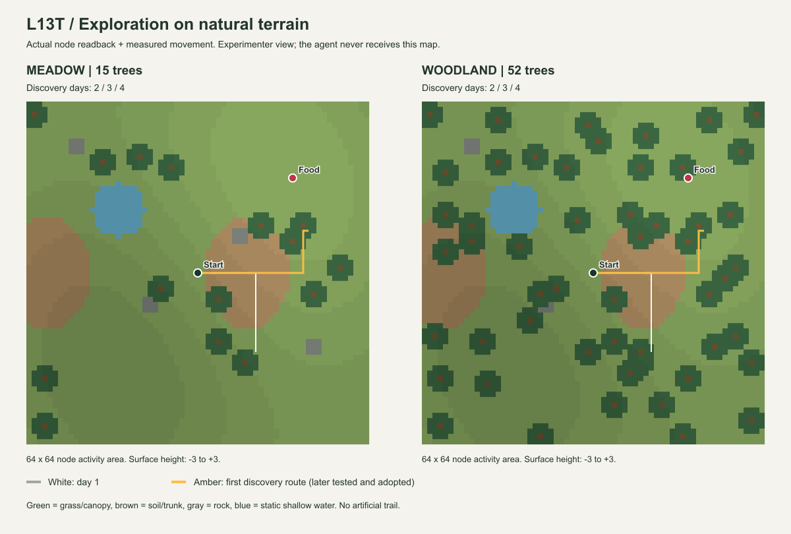

# Luanti L13T — 自然地形での探索・Sleep・再訪 Evidence

状態: FINITE ACCEPTANCE PASS。2026-09-27。
[契約](../experiment-contracts/LUANTI_L13T_natural_exploration_contract.md)。
基準commit `f2ab4fb` ＋ L13T working tree。Luanti 5.17.0 / Windows、実サーバー・HTTP往復。

## 結果

道のない起伏地形で、草地と木立の2系列を実行した。最終配置では**両系列とも2・3・4日目に発見**。
2日目の本人の観測・実作用から候補を形成し、3日目に別日ProbeでRETAIN、日末T1/M_B採用、
4日目にactive M_Bから59操作の経路を実行して再発見した。
今回、木立密度による発見日の差は出なかった。結果に合わせた配置/試行seedの再探索はしていない。

| 最終系列 | 草地 `natural_meadow` | 木立 `natural_woodland` |
|---|---:|---:|
| 木の配置数 | 15 | 52 |
| 完了日数 | 4 | 4 |
| 発見日 | 2, 3, 4 | 2, 3, 4 |
| 受理観測/操作 | 256 / 256 | 256 / 256 |
| moved / turned / blocked / waited | 205 / 27 / 22 / 2 | 205 / 27 / 22 / 2 |
| 上り / 下りの実作用 | 16 / 6 | 16 / 6 |
| 距離内だがFoodが遮蔽された観測 | 18 | 18 |
| pickup | 0 | 0 |
| Candidate支持 / 独立検査 | 1日 / 1日 | 1日 / 1日 |
| 検査 / 採用 | RETAIN / 3日目末 | RETAIN / 3日目末 |
| 4日目のactive M_B選択 | 59操作 | 59操作 |

合計**8独立World run、512受理観測、512操作**。全日16秒の時間上限で終了し、4日目の日末処理後に3回発見として系列を閉じた。
Foodを実際に取得した記録は今回はない。発見をpickupや帰還成功へ読み替えない。
各日は位置・地形・Foodをharnessが復元する。本人の自力帰還ではない。

各日同じ乱数系列を両配置へ渡している。今回通った範囲では両者の操作種別・変位・結果件数が一致した。
増えた木が常に探索へ影響するとは限らず、この同結果もそのまま残す。

## 地形と身体の実測

地表は-3..3の起伏、草/土、岩4か所、水面高-1の81列の浅い水域、木の幹と樹冠。
植生は固定seed719で格子中心から±3nodeずらし、同じ配置候補から密度だけを変える。
この乱数はFoodと独立し、個体側の初期試行seed20260927とも別。
遠景には従来の山3か所を維持。地形生成後のnode名readbackをhash化し、各日一致を確認した。
hash対象は自然地形層で、後置した山は従来の別readback記録で検査する。

- 草地: `b4c975d3ff6c0a75f1b9913bed2cee4e0bee9bfe`
- 木立: `440a55b3e3d6ffe1754b624a5385a15d5ffb98ff`

移動先を高さ関数から選ばず、実ノードの局所支持面・足/頭の空間を4中間地点で検査した。
実際の身体位置から上下移動を読み戻し、HTTP resultの`up`と一致を検査。
段差上限、幹、水、未ロード、支持面不足、2段落差等の境界は追加Lua試験で確認した。
この18アサーションはread関数を代替した局所試験。主系列の身体変位・衝突・遮蔽は実Worldで発生したもの。



図は実ノードreadbackと実測経路から生成した俯瞰図で、Luantiクライアントのスクリーンショットではない。
白は初日、黄は初回発見まで。Food/全体地形/実位置は実験者専用で、Runtimeへ渡していない。
今回の実行はheadless serverであり、GUI目視による3D画面受入は実施していない。

## 何を再利用したか

初回発見までの59操作には**blockedが3回含まれる**。それも本人の経験として残り、別日で再現された。
検査・採用後もその59操作と取得条件を使うため、成功経路の短縮や障害回避の学習を実証したとはしない。
発見までの実測3D距離は3日とも約51.071node。未学習時に失敗した動作を自動削除する変更もない。

| 系列 | 初回の取得時刻 | 検査日の取得時刻 | 採用後の取得時刻 |
|---|---:|---:|---:|
| 草地 | 14,760,011 µs | 14,771,656 µs | 14,768,433 µs |
| 木立 | 14,764,267 µs | 14,767,719 µs | 14,751,408 µs |

取得時刻の小差は各runの実World時計を保存したもの。tick境界へ書き換えていない。
新しい面観測のmodel/profile、粗色・遠景角域、実測status/up、取得姿勢参照を照合した。
T1の支持は1日、検査は未使用の1日。普遍的な地形知識や確実な再到達能力ではない。
本試験では採用後の実行を確認したが、同一履歴でcutoverだけを変えた追加の実World分岐は行っていない。
その因果対照は旧[L13S Evidence](LUANTI_L13S_learned_exploration_evidence.md)の範囲として維持する。

## 試験と保存

- L13T Python: **14 PASS**。schema隔離、3D距離、上下差、再送、色を経路規則にしないこと、取得不足、
  Sleep/T1、上下結果不一致のDEFER、旧モデルの非適用、契約切替の非公開、HTTP拒否、全実記録再生、readback改変拒否。
- 各自然World内: 既存Lua **24 assertions** ＋ 自然地形adapter **18 assertions**。
- Python全体: **730実行 = 679 PASS + 51 intentional skip**、33.599秒。
- 旧L13A `faults`を実Luantiで再実行: **PASS**。42観測、距離37、Food発見7,522,119µs、pickup10,295,663µs。
  応答消失後new_frames=0、遅延中の取得、期限切れ、旧操作の非再実行を確認。
- 旧L13Sを含む保存済み実記録は全体試験で再生。今回それらの全World試験を再実行したとはしない。

全体試験の初回は既存の未知HTTP endpoint検査でWindows `ConnectionAbortedError 10053`が1件発生した。
未読POST本文を残して404を返す経路を修正し、上限内本文を消費してから拒否する。
空/小/128KBの未知本文を使う回帰と全体730件を再実行して通過した。受理endpointの動作は変更していない。

保存fixture: [luanti_l13t_replay.json.gz](../../tests/fixtures/luanti_l13t_replay.json.gz)、1,055,882 bytes。
SHA-256: `09c37c03171948c9225dd026c8cb570d6d24d2a1fa89592a8e467affac5e378a`。
各元snapshotのSHA-256とJSON内容一致を確認して、全HTTP wire・World readback・日末状態を保存した。
Runtimeへ渡す材料と実験者用geometryは保存上も別領域にある。
producer hashは取得時の値を保持。取得後の変更は前記HTTPの未知入口修正と、未発見でも図を出せるrenderer修正。
現在コードによる全受理wire再生で同じ観測・行動・保存状態を確認した。

開発中のsmoke、段付き水面、格子状植生の試走はこの8 run・512観測へ含めない。
水面の水平化と植生の不規則化は形状の修正で、発見日を改善するためのseed探索ではない。
最終植生にして両配置の発見日が一致した結果を採用し、以前の差を最終結果として報告しない。

再実行:

```powershell
python -m integrations.luanti.tests.run_natural_exploration --output integrations/luanti/output/l13t-new.json.gz
python -m integrations.luanti.tests.check_learned_exploration tests/fixtures/luanti_l13t_replay.json.gz
python -m unittest discover -s tests -p test_natural_exploration.py -v
```

現在の限界は、kinematicな1段移動・静的水域・粗い有限センサー・経路の逐次再現。
一般の自然地形歩行、転倒/跳躍、夜間、動的障害、位置同定、未知障害への迂回学習は別の課題。
