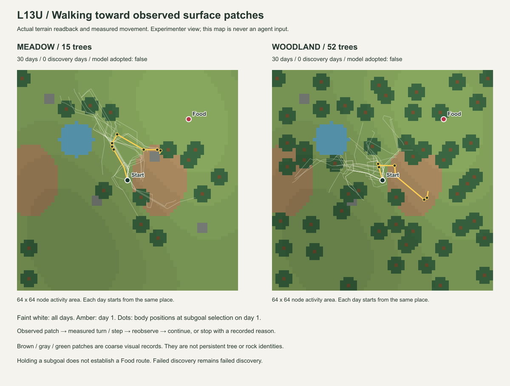

# Luanti L13U — 観測した小目標の保持と再観測 Evidence

状態: 有限制御の受入PASS。Food発見目標は両系列とも上限30日で未達。2026-09-27。
[契約](../experiment-contracts/LUANTI_L13U_landmark_exploration_contract.md)。
基準commit `7f7916b` ＋ L13U working tree。Luanti 5.17.0 / Windows、実サーバー・HTTP往復。

## 実行条件

L13Tの草地/木立をそのまま使い、初期seed20260927、別日3回発見/最大30日の2系列を実行する。
Food位置、地表形状、岩、水域、木立の配置は前回から変更していない。
各日はharnessがWorld・身体を復元する。本人が帰還したという意味ではない。

今回変わるのは、初期の方向/歩数テープを、**現在観測した粗い面特徴の選択→保持→再観測**へ置き換える部分。
13本の水平rayで実ノードの最初の面を取得し、個体へ渡すのは色・角域・距離帯と観測内refだけ。
実験者用のnode名・位置・実距離を個体の判断材料へ入れない。

小目標へ向く制御は初期能力として与えた。目印にFoodへの価値を与えたり、発見しやすい配置/seedへ直したりしない。
初期の候補抽選は観測された特徴内で行う。新しい日に選択が変わっても、それだけでは学習による改善と数えない。

## 結果

**草地30日・木立30日の計60独立World runを完了し、両系列ともFood発見0回・pickup0回だった。**
系列は`discovery_target_unmet_at_limit`で終了。失敗から成功候補を作る補完は行わず、Candidate・独立検査・M_B採用はいずれもなし。
制御の受入PASSとFood探索の未達を分ける。

| 主系列の結果 | 草地（木15本） | 木立（木52本） |
|---|---:|---:|
| 独立日数 | 30 | 30 |
| 受理観測 / 操作 | 1,920 / 1,920 | 1,920 / 1,920 |
| 水平ray取得 | 24,960 | 24,960 |
| 選択した小目標 | 240 | 240 |
| 身体操作後も継続できた小目標 | 181 | 159 |
| 近距離帯を再取得して終了 | 24 | 10 |
| 複数候補で終了 | 148 | 158 |
| 見失って終了 | 46 | 38 |
| 通行不能で終了 | 5 | 19 |
| 一目標の12操作上限で終了 | 17 | 15 |
| moved / turned / blocked / waited | 747 / 279 / 5 / 889 | 566 / 301 / 19 / 1,034 |
| 実測3D移動距離（node） | 790.078 | 592.510 |
| Food発見 / pickup / M_B採用 | 0 / 0 / なし | 0 / 0 / なし |

合計3,840観測、49,920本の水平ray、480小目標。終了理由の表は一目標一件で数え、wait中の同じ状態を新しい失敗に数えない。
一日の8目標を使い切った後のwaitは草地649枠・木立794枠。候補なしによる見回しは草地で1許可、木立で0許可だった。
完全な空取得から4回見回す境界は合成試験で検査しており、主系列で実現したとはしない。

木立では通行不能が増え、近距離帯の再取得と移動距離が減った。同じseedでも取得候補が違うので実行列は変わる。
この二配置・有限予算の結果から、目印利用一般の優劣や学習の因果効果は結論しない。
L13Tの方向テープでは両系列とも発見できたが、今回の粗い特徴の保持には曖昧さと予算による停止が多い。
**「目印へ進む機構ができた」と「Foodを見つける探索が改善した」は別で、後者は今回示されていない。**



白い線は全30日、黄は1日目、点は1日目に小目標を選んだ身体位置。推定した目標位置ではない。
Food位置・全体地形・身体のWorld座標は実験者用の図にだけ使う。Luantiクライアントのスクリーンショットではない。

## 実測でつながったこと

草地1日目の最初の小目標は、brown / far / [-22.5, -7.5]度の特徴。
指令-15度に対し実測`-15.00000041741302`度で回転し、以後の観測では中央付近の対応候補を用いて前進した。
この小目標は12操作の上限で終了した。新しい観測のfeature refが同じでも違っても、refの文字列では同一性を判定しない。

各小目標は元の観測・特徴・姿勢・取得時刻を保持する。
移動/回転後は実行resultのafter pose/revisionと次観測を結び、実測yawから角域を対応づける。
角域を満たす候補が複数あるときはすべてを診断へ残し、waitで終了する。
`near_feature_observed`も近距離帯で条件を満たす記録が得られたという意味に留め、対象への到着やFood成功へ昇格させない。

距離・回転量は実身体readbackから検査した。小角度回転も既存のpose/revision・期限・操作台帳を通し、
同操作IDの再送で再回転しない。rayのprivate hit座標と取得姿勢・実距離を独立に照合し、
そのauditから再構成した粗色/角域/距離帯がHTTPの観測と一致することを検査した。
離散ray間の未取得領域や、同色の別物体が混ざる可能性まで消えたわけではない。

## 学習についての限定

日末にはL13SのSleep処理を呼び、本人の観測・実作用を別Episodeとして保持する。
Food発見のない日は`no_eligible_discovery_route`であり、Food到達関係のCandidateを作らない。
失敗理由を保存することと、その失敗を使って次の日の候補評価を改善することは別で、後者の一般機構は今回追加していない。

合成の三日試験では、初日の発見列→別日の検査Probe→RETAIN/T1/M_B→三日目のactive M_B選択を確認した。
観測キーには新しい面観測条件が含まれ、ローカルfeature refは含まれない。
M_B/検査Probeの経路実行中は小目標制御を`suspended`として区別する。
この合成正例を、実地形でFood再訪や採用まで成功したという証拠に足さない。

L13Tと今回を比べると初期制御と取得条件が変わるため、発見日の差だけをSleepの効果へ帰属させない。
今回も経路の複数目印への圧縮、場所同定、一般的な迂回学習は実装していない。

## 試験・保存・追試

- L13U Python: **21 PASS**。うち実記録の完全再生・実測小角度回転・改変拒否の3件を含む。
- 各自然World内: 既存Lua **24 assertions** ＋ 自然地形 **18 assertions** ＋ 小目標sensor/controller **10 assertions**。
- Python全体: **751実行 = 700 PASS + 51 intentional skip**、27.265秒。
- 旧L13A `faults`の実Luanti回帰: **PASS**。42観測/42操作、距離37、発見7,517,824µs、pickup10,273,988µs。
  応答消失後new_frames=0、遅延中の通常取得、期限切れ、旧操作の非再実行を確認。
- 旧L13S/Tなどの保存replayは全体試験で維持。旧実験の全World runを再実行したという意味ではない。

保存fixture: [luanti_l13u_replay.json.gz](../../tests/fixtures/luanti_l13u_replay.json.gz)、4,004,791 bytes。
SHA-256: `cc95a4c5274346f9374a059f674908bafbd384abbd9f459557ef85ab8d2800c7`。
主系列60runと旧平地の回帰1runを保持する。

最初の取得後監査は、木立2日目以降の負の半整数座標で停止した。
Python検査器が常に`floor(x + 0.5)`を使っていたのに対し、実Luantiの`vector.round`/`math.round`は半整数を0から遠い側へ丸める。
例えば眼高-0.5のnodeは-1であり、0ではない。インストール済み`builtin/common/math.lua`で規則を確認して検査器を修正し、
正負の半整数の回帰を追加した。同じ60日分の記録を再検査して通過。センサー・身体・選択・World記録は変更していない。
元の系列checkpointと監査失敗は開発outputに残し、同梱fixtureの`validation_history`にも修正と再検査を記録した。

実機に出なかった境界は合成試験として明記する。空取得時の見回し上限、partial、実行結果欠測、
一目標12操作/一日8目標、複数候補、nearとFoodの分離、実測yawの境界、観測再送/受理失敗の非消費をPythonで検査した。
Luaの10アサーションはread/身体adapterを代替した局所試験で、実Worldの成功件数へ加えない。
未知ノード/未ロードをpartialとし、手前の面による遮蔽、192点の打切り、小角度回転と二重実行防止を確認した。

保存記録には、全HTTP request/response wire、Runtime状態、Worldの実測、各日Sleep結果、系列終端を含める。
元snapshotのSHA-256とJSON内容一致を確認し、取得開始時のproducer hashを保持する。
取得開始後のコード変更は、非辞書configureを明示拒否する入口検査と、前記の監査器の丸め修正。
正常な取得・選択規則は変更していない。最終コードのhashも保存し、全wire再生で同じ結果になることを確認した。

開発中の草地1日smokeは主系列の件数へ含めない。失敗を理由にseedを変更した再試行は行っていない。
実行はheadless Luanti serverであり、GUIによる歩行画面の目視受入は実施していない。

```powershell
python -m integrations.luanti.tests.run_landmark_exploration --output integrations/luanti/output/l13u-new.json.gz
python -m integrations.luanti.tests.check_learned_exploration tests/fixtures/luanti_l13u_replay.json.gz
python -m integrations.luanti.tests.summarize_landmark_exploration tests/fixtures/luanti_l13u_replay.json.gz
python -m unittest discover -s tests -p test_landmark_exploration.py -v
```
