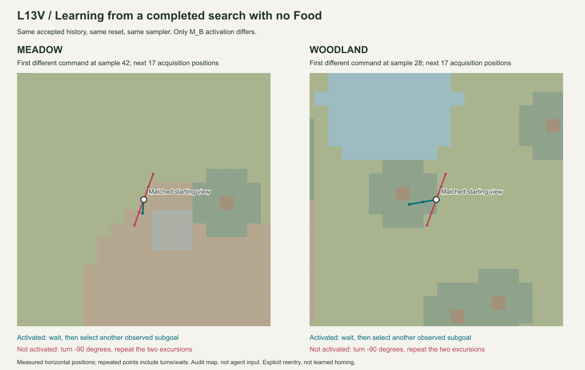

# Luanti L13V — 目印周辺の有限探索・未発見M_B Evidence

状態: 有限探索・未発見候補・独立検査・M_B行動差の受入PASS。通常系列のFood発見3回は両地形とも未達。2026-09-27。
[契約](../experiment-contracts/LUANTI_L13V_neighborhood_exploration_contract.md)。
基準commit `9e016ed4` ＋ L13V working tree。Luanti 5.17.0 / Windows、実サーバーとHTTP往復。

## 実行した問い

L13Uと同じ草地/木立・seed20260927・最大30日・別日3回発見を使う。
同じ地形とFood位置を維持し、発見しやすい配置やseedへの調整はしない。
各日16秒・最大64観測/操作で、Worldと身体はharnessが毎日復元する。自力で拠点へ戻る能力の試験ではない。

観測された特徴へ接近した後、二方向へそれぞれ2歩の往復を行う。
これは与えた身体制御で、周辺探索方法そのものを学習したとは数えない。
17完全観測・16実操作・二回の帰還確認が揃った未発見だけを関係候補へ渡す。
二方向の線上で調べた範囲であり、地域全体のFood不在ではない。

## 通常系列と学習の到達点

最初の適格な未発見候補について、形成日と別の検査日で同じ有限な探索を実行した。
日末Sleep、別日Probe、RETAIN、既存T1-A/B/C、M_B cutoverまで実記録で確認する。
支持は形成日の1 Experience、検査は別日の1 Experience。操作数や日末の再送では増えない。

| 通常30日系列 | 草地 | 木立 |
|---|---:|---:|
| 観測 / 操作 | 1,920 / 1,920 | 1,920 / 1,920 |
| 小目標の選択 | 232 | 236 |
| 周辺探索の開始 | 23 | 9 |
| 完全な未発見で終了 | 19 | 9 |
| 通行不能 / 日末途中終了 | 1 / 3 | 0 / 0 |
| 未発見候補形成日 / 独立検査・採用日 | 2 / 3 | 4 / 5 |
| 通常日のM_Bによる探索省略 | **0** | **0** |
| moved / turned / blocked / waited | 921 / 456 / 6 / 537 | 648 / 389 / 19 / 864 |
| 実測3D移動距離（node） | 973.191 | 678.238 |
| Food発見 / pickup | **1 / 0** | **0 / 0** |

周辺探索の件数は一つのsurvey IDを一回だけ数える。保持中のstateを毎枠新しい試行にしない。
独立検査Probeの日は別権限で記録済みの列を実行しており、上のcontrollerによる開始件数へ含めない。
両系列で検査Probeによる完全な未発見が別に一件ずつある。

草地では24日目、11,261,284µsに局所Foodを初めて観測した。pickupには至らない。
木立では30日とも未発見。両系列とも `discovery_target_unmet_at_limit` で終了し、別日3回発見の目標は未達。
草地での発見は周辺探索を追加した今回の結果だが、**通常系列にはM_Bの省略が一度もなかった**ため、
この発見をM_Bによる改善とは数えない。前回L13Uとの違いには与えた身体制御の変更も含まれる。

通常60runは3,840観測・49,920水平ray。粗い外観を厳密に照合する現行M_Bは、別の抽選経路で自然に再利用されなかった。
「未発見の関係を採用できた」と「後日の通常探索で有効に利用できた」は分ける。

## 同一履歴・cutover対照

最初の独立検査までの同一の受理済みExperienceを二分し、一方はM_B採用、他方は検査・再構成までに留める。
候補・独立検査・再構成artifactは同一で、過去のWorld記録も同一。
両者の次の日だけ形成日の抽選seedを明示再使用し、初期地形・身体・観測条件を合わせる。
各側で新しい実Luanti runを実行する。過去記録を二分して再生した部分は、新しいWorld runにも支持数にも加えない。

対応する取得条件へ戻った最初の分岐で、active M_Bは `wait`、未採用側は `turn -90`。
Worldの実測もwaitと約-90度の身体回転に分かれるかを検査する。
分岐以前の粗い取得キー、実測身体位置・向き、初期World、抽選seedも一致させる。

この再進入は試験側が指定している。本人が場所を認識して自律的に帰還した証拠ではない。
また、モデルが省略するのは接近後の16操作だけであり、遠くからその場所を避ける機構ではない。

| 実World対照 | 草地 | 木立 |
|---|---:|---:|
| 共通の既存履歴 | 3日 | 5日 |
| 最初の行動分岐（sample_seq） | 42 | 28 |
| 採用側の指令 / 実測yaw | wait / 0度 | wait / 0度 |
| 未採用側の指令 / 実測yaw | -90度 / -90.000002504度 | -90度 / -89.999982014度 |
| 採用側の省略 / 未採用側の完全な再探索 | 1 / 1 | 1 / 1 |

対照は各地形2run、計4run。通常60runと合わせて**64実Luanti run・4,096観測/操作・53,248水平ray**。
対照4runもFood発見・pickupは0。省略で直ちにFoodへ到達したわけではない。



分岐時から17取得位置を表示。青緑がM_B採用、赤が未採用。回転とwaitは同じ位置へ重なる。
背景と位置は実測auditから作成した実験者用の図であり、個体へ渡す地図やLuanti画面のスクリーンショットではない。

## 結果を過剰に一般化しないための境界

一系列一候補・一検査・一更新というL13Sの有限条件を維持する。
未発見候補が既に形成された後にFoodが見えても、二つ目のFood経路を追加学習する機能はない。
後日の `tentative_no_discovery` というSleep statusは保持中の候補の種別を示し、毎日新たな候補や支持を作る意味ではない。
採用の有無は `summary.adopted` とcutover、検査の結果はinspectionを正本とする。

M_Bの条件はprofile・粗い地表/遠景/面特徴・起点特徴・plan・期限・系列まで含む。
少し違う場所や似た木へ一般化しないため、日常の別経路では一致しにくい。
条件一致時に実行が変わることと、通常探索の発見効率が改善することは分ける。
現在Foodが見える場合は過去の負の予測で探索を省略しない。

未発見をCore Eや不快へ置き換えない。
T1の明示reviewには、形成日の実際の面特徴数の差を専用perception ruleで使う。
Food未発見関係のRETAINには別日の完全探索という別の根拠を使う。
面特徴数の差だけでFood不在を導いたわけではない。
実際の非ゼロ差がなければ `review_difference_unavailable` でcutoverしない。
全取得が不完全な日はcanonical count断面を作らず、未取得をゼロ件へ読み替えない。

## 検査範囲

- L13V Python: **23 PASS**（合成・境界20件、実記録再生・cutover対照・実帰還audit改変拒否3件）。
- Python全体: **774実行 = 723 PASS + 51 intentional skip**、38.445秒。
- 新規実Luanti: **64run PASS**。旧L13A配送障害回帰: **1run PASS**。
- 全64runと対照の既存履歴、旧回帰を最終コードで再生一致。旧L13S/T/Uなどの保存replayも全体試験で維持。

合成試験では、通行不能、取得不足、実測欠測、上下方向の帰還失敗、対応特徴0件/複数件、
取得時刻による期限超過、検査中のFood反例、旧run/同日の再利用、二重受理、日末途中失敗を検査する。
モデルの用途・plan・期限・系列・取得条件の違い、現在見えるFood、ゼロのCore差、全取得不足も分ける。
合成の正のFood候補で既存L13Sの経路学習も維持する。
これらの境界全部を実地形で発生させたという意味ではない。

実Worldは既存のLua 24＋自然地形18＋面取得/身体10アサーションを実行する。
新しい周辺制御はPython側。Worldからの実行結果と次の取得を確認して次許可を決める。
元のray readback、身体の回転/上下差、二回の帰還位置を実験者用auditで独立に確認する。
auditのWorld座標・node名・Food位置を選択器やM_Bへ渡さない。

保存記録は全wire・受理state・実身体readback・日末結果・canonical state・出典を含む。
取得開始時のproducer hash、最終コードのhash、元snapshotのSHA-256とJSON内容一致を保存する。
取得中に追加した入口保護は、通常日を再訪seedへ変更することの拒否、現在Foodがある場合の省略禁止、
全取得不足時にcanonical countを作らない処理。監査には分岐前の実測yaw一致も追加した。
元World記録は変更せず、最終コードで全wire・全日末状態を再生する。
初回の全体試験では、新しい拡張用hookが元関数を固定参照したため、既存の途中失敗注入を迂回する1件が失敗した。
既定hookを呼出し時の元関数への委譲へ修正し、既存のatomic failure試験を維持した。
取得・選択規則や保存World記録は変更していない。

保存fixture: [luanti_l13v_replay.json.gz](../../tests/fixtures/luanti_l13v_replay.json.gz)、**8,273,986 bytes**。
SHA-256: `797ea2f5c31e2b5ed789c9525786d0888f234066c72c9d6e74a44e7ce06eda59`。
64件の新しいWorld snapshotの元hashを照合済み。再進入対照の複製された既存履歴は同じ出典を共有する。
旧L13A `faults` の実回帰1件も同梱する。42観測/42操作、実測距離37、発見7,520,808µs、pickup10,292,042µs。
応答消失後の `new_frames=0`、遅延中の通常取得、期限切れ、旧操作の非再実行がPASS。
主実験と旧回帰を合わせて65新規World run、4,138観測。旧実験群の全runを再取得したという意味ではない。

開発用の草地1日smokeは主系列の件数に含めない。
実行はheadless Luanti server。GUI画面の目視受入ではない。

```powershell
python -m integrations.luanti.tests.run_neighborhood_exploration --output integrations/luanti/output/l13v-new.json.gz
python -m integrations.luanti.tests.check_learned_exploration tests/fixtures/luanti_l13v_replay.json.gz
python -m integrations.luanti.tests.summarize_neighborhood_exploration tests/fixtures/luanti_l13v_replay.json.gz
python -m unittest discover -s tests -p test_neighborhood_exploration.py -v
```
