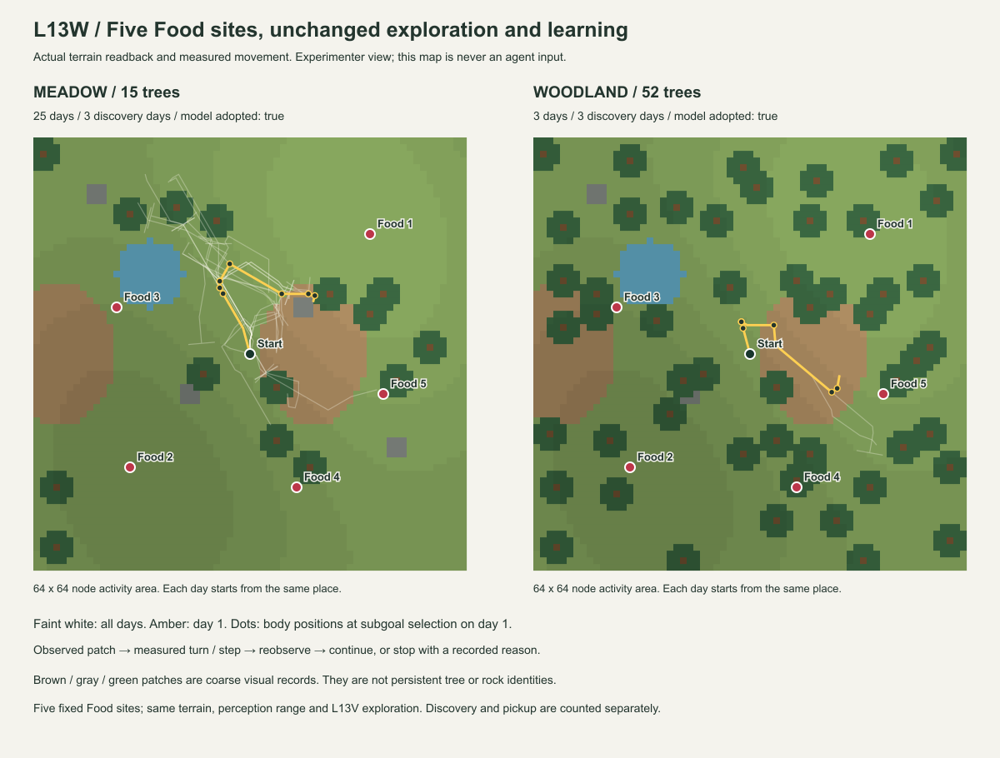

# Luanti L13W — Food 1個 → 5個の探索 Evidence

状態: 実機受入PASS。草地25日・木立3日で別日3回発見、pickupは計1回。2026-09-27。
[契約](../experiment-contracts/LUANTI_L13W_multi_food_exploration_contract.md)。
基準commit `e17f5b6b` ＋ L13W working tree。Luanti 5.17.0 / Windows、実サーバー・HTTP往復。

## 固定した条件

L13Vの草地/木立、地形・山・初期身体・局所視認距離12・ノード遮蔽、小目標と周辺探索、
Sleep・独立検査・T1/M_B、seed20260927を維持する。停止は別日3回発見または最大30日。
毎日の初期化はharnessの操作。本人の帰還やFoodの自然再生を学習したわけではない。

元のFood `(18,18)` に4地点を追加し、両地形で同じ5個とした。
World座標は実験者側だけに保持し、個体には現在見えたFoodのrefと身体相対位置だけを渡す。
魚や食物種類、地形から食物を発生させる規則は追加しない。
全地点を開始時の範囲外へ置き、地形を削って見えるようにはしない。

| audit上の番号 | x / z | 扱い |
|---|---|---|
| 1 | 18 / 18 | 前回から維持 |
| 2 | -18 / -17 | 追加 |
| 3 | -20 / 7 | 追加 |
| 4 | 7 / -20 | 追加 |
| 5 | 20 / -6 | 追加 |

この番号を経路や価値の条件として個体に教えてはいない。
配置は実行前に固定し、既存terrain readbackで確認した。結果を見てFoodを動かす調整は行っていない。

## 結果

**草地25日、木立3日で、別日3回発見の停止条件へ到達した。** 合計28実World run、1,784観測/操作、23,192水平ray。

| 結果 | 草地 | 木立 |
|---|---:|---:|
| 終了日 | 25日目 | 3日目 |
| Foodを初めて観測した日 | 21 / 24 / 25 | 1 / 2 / 3 |
| 各日の初回発見地点（audit番号） | 5 / 1 / 4 | 5 / 5 / 5 |
| 発見日数 / 実pickup | 3 / **1** | 3 / **0** |
| 観測 / 操作 | 1,592 / 1,592 | 192 / 192 |
| moved / turned / waited / blocked / pickup | 783 / 380 / 422 / 6 / 1 | 104 / 43 / 45 / 0 / 0 |
| 実測3D移動距離（node） | 824.836 | 106.485 |
| 最初に形成した候補 | 完全な未発見 | Food再観測経路 |
| 候補形成日 / 独立検査・採用日 | 2 / 3 | 1 / 2 |
| active M_Bによる経路操作 / 周辺探索省略 | 0 / 0 | **33** / 0 |
| 一観測で同時に見えた最大Food数 | 1 | 2 |

草地では21日目の9,516,274µsに追加地点5が見え、その日に距離1.148まで近づいて実pickupが成立した。
24日目は元の地点1、25日目は追加地点4を発見したが取得には至らなかった。
先に形成していた未発見候補のM_Bが保持され、その条件へは再一致しなかった。草地の発見を学習による経路改善とは数えない。

木立では初日の8,252,915µsに地点5を発見して正の経路候補を形成した。
2日目は明示した独立Probeで33操作後に再観測し、RETAIN→T1/M_Bへ採用。
3日目は `active_M_B` による33操作後、8,252,837µsに再観測した。
これは実際の学習経路の使用だが、同じ5地点でcutoverなしの対照は今回実行していない。
「3日で達成した差の全てが学習の効果」とは結論しない。2日目の経路には試験側の検査権限がある。

木立の3回は毎日復元した同じ地点5の再観測であり、3か所の独立した餌場の発見ではない。
地点5への取得時最短距離は4.873で、pickup圏内には入らなかった。
3回発見は「食べて生活できた」というAcceptanceではない。

### 前回の単一Foodとの比較

| L13V → 今回L13W | 草地 | 木立 |
|---|---|---|
| 単一Food | 30日で発見1回、取得0回 | 30日で発見0回、取得0回 |
| 5個Food | 25日で発見3回、取得1回 | 3日で発見3回、取得0回 |

地形readback、初期身体、山、元Food位置は保存L13Vと一致する。
増えた資源への遭遇が、学習へ渡る材料の種類も変えた。草地では未発見候補、木立では初日のFood経路が最初の候補になった。
地形と資源の配置が違うと結果は変わるため、木立一般の方が探索しやすいという結論ではない。

### 数だけでなく視認できた範囲も残す

表は「取得時最短距離 / 範囲内の資源判定数 / うち遮蔽 / 可視記録数」。一つのFoodを複数枠で見た分も含む。
独立なFood数やExperience支持数ではない。

| 地点 | 草地 | 木立 |
|---|---|---|
| 1（元配置） | 11.073 / 5 / 0 / 5 | 19.976 / 0 / 0 / 0 |
| 2 | 20.491 / 0 / 0 / 0 | 24.940 / 0 / 0 / 0 |
| 3 | 12.087 / 0 / 0 / 0 | 18.937 / 0 / 0 / 0 |
| 4 | 10.117 / 31 / 26 / 5 | 11.359 / 2 / 1 / 1 |
| 5 | 1.148 / 18 / 0 / 18 | 4.873 / 93 / 0 / 93 |

追加した地点2・3は両系列で未観測。地点4は草地で距離内に31回入ったが26回は遮蔽された。
「5個置いたから5個の経験が得られた」わけではない。



白い線は全日、黄は初日。点は初日に小目標を選んだ身体位置。
草地25日と木立3日では描いた日数も異なる。経路が重なることだけから、学習や迷いを判定しない。

## 学習と観測の境界

同時に複数個見えても、日数とExperience支持数は増やさない。
正の経路候補が形成された場合、最初の0件から実際のN件へのCore差を保持し、1へ丸めない。
形成支持1・別日の検査1という既存契約を維持する。
検査の目的は「この経路後に何らかのFoodを再観測する」であり、同じFood個体や全5地点の発見ではない。

一系列一候補というL13Vの限定も残る。先に未発見候補が形成された系列では、
後からFoodが見えても二つ目の正の経路候補を追加学習しない。
また、Foodを遠くに発見しても新しい接近行動は起動しない。距離1.25以内の既存pickup規則だけを優先する。
発見・接近・取得・経路学習の結果を混同しない。

初回の探索、別日の明示検査Probe、採用後のM_B経路をそれぞれ記録する。
今回とL13Vでは資源条件が変わるため、発見数や日数の差を学習機構だけの効果とはしない。
一般的な密度と成功率の関係、原始生活の食料構成、生態的法則の獲得を示す実験ではない。

## 受入・出典

- L13W Python: **9 PASS**（合成6件、実World再生・旧地形との一致・audit改変拒否3件）。
- Python全体: **783実行 = 732 PASS + 51 intentional skip**、45.957秒。
- 主実験28runと旧単一Foodの障害回帰1run: **PASS**。
- 主実験は最大2個の同時可視を実現。初回5個同時発見のCore差と支持数は合成試験で確認しており、実World件数に足さない。

取得時の身体位置と各Foodの実位置から距離・相対方向・範囲判定を監査し、
各対象の実ノード遮蔽結果と、packet内の可視集合・並び・coverageを照合する。
対象一件でも範囲内で取得不足があればpartial。完全な空取得へ読み替えない。
pickupでは対象refと実距離を確認して、その一個だけを除去する。

Luaの既存24＋自然地形18＋面特徴10アサーションに、Food集合11アサーションを追加した。
追加の11件は代替ObjectRef/可視性関数による局所試験で、範囲外、遮蔽、partial、複数可視、
距離順、誤target、範囲外pickup、対象だけの除去、二重pickupを確認する。
これらを全て実地形で発生させたという意味ではない。

Pythonでは明示opt-in、旧上限1の維持、5/6件、重複ref、不正な並び、World情報の混入、
現在の近距離Food優先、初回1/2/5件のCore差と一日一支持、独立検査の反例を確認する。
実記録は全wire・Runtime状態・日末処理を再生し、L13Vと地形・初期身体・山・元Food位置の一致を検査する。

最初の起動 `l13s-02371463518541fc` は、新Luaモジュールがinstall-game.ps1のコピー対象に入っておらず、観測開始前に停止した。
インストール対象を補い、同じ配置・seed・上限で再実行した。起動失敗を発見失敗や一日分の経験には数えない。
失敗ログとcheckpointは開発outputに残し、保存fixtureのvalidation_historyにも記録する。

保存fixture: [luanti_l13w_replay.json.gz](../../tests/fixtures/luanti_l13w_replay.json.gz)、**3,431,665 bytes**。
SHA-256: `f702c3bea611d7942c01be05873164fd313b388a7f12eb294e766cd0dcefbbe7`。
元snapshotのSHA-256とJSON内容一致を確認した28runと、既存L13A `faults` の新規実回帰1runを同梱する。
producer hashと最終コードのhashを保持し、元World記録を変更せず全wire・日末学習状態を再生した。

旧 `faults` は42観測/42操作、距離37、発見7,502,093µs、pickup10,277,456µsでPASS。
応答消失後の `new_frames=0`、遅延中の取得、期限切れ、旧操作の非再実行を確認した。
主実験と旧回帰を合わせて29成功World run・1,826観測。観測開始前の起動失敗はこの件数に含めない。
旧実験群を全て実Worldで再実行したという意味ではなく、保存済みの旧記録はPython回帰で再生する。

headless Luanti serverでの受入であり、GUI画面の目視受入ではない。
地形図は実測auditから描く実験者用の図で、個体の入力ではない。

```powershell
python -m integrations.luanti.tests.run_multifood_exploration --output integrations/luanti/output/l13w-new.json.gz
python -m integrations.luanti.tests.check_learned_exploration tests/fixtures/luanti_l13w_replay.json.gz
python -m integrations.luanti.tests.summarize_multifood_exploration tests/fixtures/luanti_l13w_replay.json.gz
python -m unittest discover -s tests -p test_multifood_exploration.py -v
```
