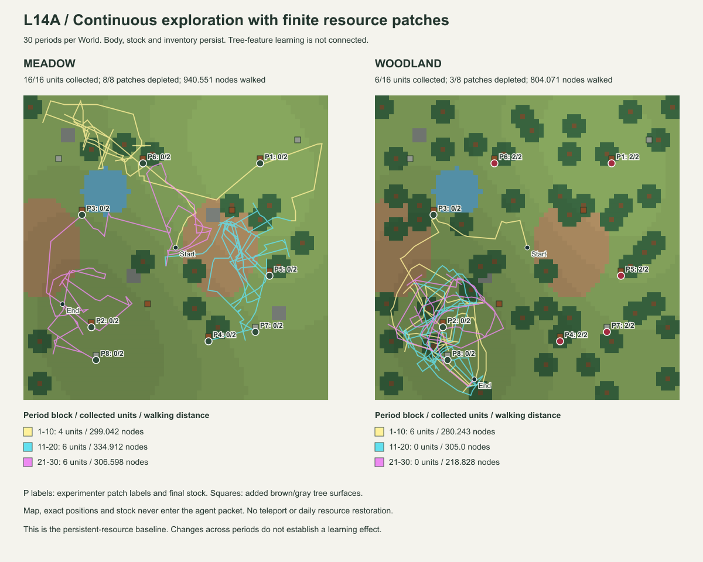

# Luanti L14A — 資源を復元しない継続探索 Evidence

状態: L14A実機受入PASS。主系列は草地・木立各30期間。2026-09-27〜28。
[契約](../experiment-contracts/LUANTI_L14A_continuous_resource_contract.md)・
[長期計画](../design/RDL_GameAI_Luanti_Resource_Patch_Learning_Plan.md)。
基準commit `92a0b384` ＋ L14A working tree。Luanti 5.17.0 / Windows、headless実サーバー・HTTP往復。

## 今回の到達範囲

一地点2単位の実、見本教示、観測した実への有限接近、期間をまたぐWorld・身体・所持品、枯渇後の再探索を実装した。
木の特徴からの帰納、Sleepによる反復更新、別地点の独立検査、T1/M_Bによる探索先選択は未接続。
**長期学習計画の前提となる継続資源基準であり、学習効果の実験結果ではない。**

神の像は実際の描画資産の見本を2node先に提示する。実ノード遮蔽・texture readbackを確認し、
出典付きの「この外観の実は既知の加工後に食料になる」というstatementだけを受理する。
木の色・位置・残量は教えない。見本は取り除き、実採集には数えない。
加工・摂食・栄養回復は実行していない。

草地と木立に同じ8資源群（各2単位）・12本の特徴木を置く。
6資源群にはbrown、2資源群にはgrayの幹があり、各色2本ずつ実のない木もある。
外観は既存13rayのfirst-surface観測へ届くが、個体は木の名前や資源群IDとして解釈していない。
素材外観は登録spriteを照合する有限adapterで、一般画像認識ではない。

## 実World結果

主系列2run・60期間・3840観測/操作に、2期間の陽性/障害対照を加えて、**3run・62期間・3968観測/操作がPASS**。
別途、旧単一Foodの`faults`を1run・42観測/操作で回帰した。

| 結果 | 草地 | 木立 |
|---|---:|---:|
| 実pickup / 初期量 | **16 / 16** | **6 / 16** |
| 採集地点 / 枯渇地点 | 8 / 8 | 3 / 3 |
| 終了時の残量 | 0 | 10 |
| 実測移動距離（node） | 940.551 | 804.071 |
| moved / turned / waited | 907 / 519 / 461 | 802 / 546 / 561 |
| blocked / stale | 17 / 0 | 3 / 2 |
| 最初の取得 / 最後の取得（秒） | 20.527 / 461.337 | 22.290 / 60.785 |
| 通常観測 / 操作許可 | 1920 / 1920 | 1920 / 1920 |

草地は地点6→1→5→7→4→3→2→8の順で各2個を採集した。最後の取得後も480秒まで探索を継続した。
木立は地点3→2→8から約60.8秒までに各2個を採集し、以後の追加取得は0。
残る地点1/4/5/6/7は、全取得枠で局所視認距離12の外だった。最短距離は順に23.244/12.542/20.976/12.520/22.285。
未取得を資源の不在とは扱わない。図では木立の経路が南西へ偏り、取得済み地点付近で探索が続いている。

| 期間 | 草地: 取得 / 距離 / 操作数÷取得 | 木立: 取得 / 距離 / 操作数÷取得 |
|---|---|---|
| 1〜10 | 4 / 299.042 / 160 | 6 / 280.243 / 106.667 |
| 11〜20 | 6 / 334.912 / 106.667 | 0 / 305.000 / null |
| 21〜30 | 6 / 306.598 / 106.667 | 0 / 218.828 / null |

各欄の操作数は640で、待機・期限失効も費用側に残す。取得0の区間を低費用の成功として扱わない。
草地の後半で取得数は増えたが、木の特徴を学習する経路を使っていないため学習改善ではない。

一期間は16秒で、日夜や身体睡眠を表すものではない。主系列は各480秒・1920通常取得枠を継続する。
発見3回で止めず、期間境界でも身体・資源・所持品を復元しない。
移動距離は実測3D距離。所持数は実pickup結果で増え、再観測回数・配送回数とは別に数える。



図は実験者用。実ノード地形readbackへ追加木を重ね、実測経路を期間1〜10／11〜20／21〜30で色分けした。
資源の位置・残量・図全体は個体への入力ではない。

## 採集・枯渇と通信の対照

近距離2地点・各2単位の2期間対照で、計4個の実pickupと両地点の枯渇、以後の再探索を確認した。
これは未観測地点を発見した正例ではなく、現在見える実を取得する身体機構の試験。

初回pickup命令を含むRuntime成功応答をcallbackで破棄し、同じ観測を再送する。
再受理の`new_frames=0`と、身体側の操作ID消費により、所持品・在庫の二重変更を防ぐ。
期間末尾の応答を750ms保留して期限超過を作り、新期間で古いcallbackを再注入する。
全命令を再度consumerへ渡しても、副作用数と実結果は増えない。
これは有限なcallback故障注入であり、実ネットワーク切断や再起動後の一回実行保証ではない。

Runtimeに「2個採ったら別の木へ」という分岐はない。
合成試験では別の合法なWorldから同じrefの3個目が見えればpickupを選ぶ。
実World側では2個目でpileを除去するため、3個目は発行されない。木は残る。
初期の視覚運動制御と、木の価値を学習することを区別する。

## 最初の長期試験で検出した機構エラー

最初の草地30期間run `l14a-3ac07cb009f74ba2` は、1920枠完了後の在庫検査で**不合格**になった。
2個を採集した一地点以外にも、残量2のまま実体が消えた地点があった。
このrunを自然な未発見や探索の成績として採用していない。

旧短期fixtureはforceloadを25ブロック要求したが受付結果を見ておらず、既定上限16と、
負の高さのブロックが対象外だったことから、長時間のheadless実行で実体・観測面を維持できなかった。
資源モードでは全有限地形の192ブロックを明示保持し、各受付を検査するよう修正した。
未採集の実体消失も即エラーにした。配置・seed・資源量は変更せず、短い対照と草地・木立を再実行する。

不合格runの元snapshot・SHA・生成時ソースhashも、受入済みrunとは区別してreplayへ保存した。
初期の短い2期間試験2回は実装中の事前確認であり、最終受入の62期間へ加算しない。

## 学習との境界

今回の全decisionは`model_ref=null`。canonical sidecarと通常InteractionHistoryは開始時から不変。
小目標・二方向の周辺探索・現在見える実への接近は、初期に与えた有限な制御である。
木の色へ食物価値を与えていない。神の像から受けた用途も学習経験として増幅していない。

期間ごとに制御予算と中立抽選seedを更新する。場所を復元せず、学習モデルも更新しない。
L13Wとは資源量、実への接近、追加木、seed、身体/World継続、停止条件が違う。
採集数の増加をM_B学習の効果、木立と草地の差を地形一般の優劣としない。

次工程では、本人の観測・実結果から場所依存性を保った探索機会を作り、別地点で検査した特徴関係をM_Bへ採用する。
その後、同じ入力の採用あり/なし対照で未訪問場所の選択と実収量を比較する。
今回の前後半の費用表だけでは「後半ほど学習して効率化した」とは判定できない。

## 検証・出典

- L14A Python: **16 PASS**（合成13件、実World再生・継続条件・不合格記録/旧回帰3件）。
- Python全体: **799実行 = 748 PASS + 51 intentional skip**、86.940秒。
- 最終の実Luanti受入: **3run・62期間・3968観測/操作 PASS**。
- 旧単一Food `faults`: **42観測/操作、pickup 1、実測距離37.0、PASS**。
- SVGからPNGを生成し、経路・地点・残量の図を目視確認。Luantiの対話GUIは今回使用していない。

Luaの既存24＋自然地形18＋面特徴10に、資源14アサーションを加えた。
資源14件は代替ObjectRef/可視性関数で、2単位減算、3回目拒否、別対象の保持、
5件上限とpartial、完全な空観測の区別を確認する局所試験。実World試験件数へ足さない。

checkerは全HTTP wireを現在のRuntimeへ再生して応答・最終stateを一致させる。
実測身体の連続性、各期間の在庫と所持品、対象別減算、全通常枠、期限、教示出典、
実座標から再計算した相対観測、13rayの位置・色・区間とpacketを照合する。

```powershell
python -m integrations.luanti.tests.run_resource_exploration --output integrations/luanti/output/l14a-new.json.gz
python -m integrations.luanti.tests.check_resource_exploration tests/fixtures/luanti_l14a_replay.json.gz
python -m unittest discover -s tests -p 'test_resource_exploration.py' -v
python -m unittest discover -s tests -v
```

再生用記録: [`tests/fixtures/luanti_l14a_replay.json.gz`](../../tests/fixtures/luanti_l14a_replay.json.gz)。
元snapshotとのJSON全体一致と元ファイルSHAを確認してから圧縮保存した。
最終受入3run、旧単一Food回帰1run、不合格の初回長期1runを、別欄に保持する。

| run | 用途 | 元snapshot SHA-256 |
|---|---|---|
| `l14a-70fce144507046ad` | 2期間の陽性/障害対照 | `cc2bc9eee4342a2bdda29514366cb49e03fd0cb3335a1b6a792a58a8ab39568f` |
| `l14a-53dbd018840f4b3b` | natural_meadow・30期間 | `444f4946bd3afa8dbb0405a9c7360fe8fd29bb8331a424ab3240e766ae7ce4e1` |
| `l14a-2ddccdec35cc4ad1` | natural_woodland・30期間 | `64e2eb3e04984886ccba4da7a7e906be0c59c2d58acb1bf01020a1b9f48620da` |

archive: **3,115,713 bytes**、SHA-256 `e62a613d92c4b1377dc8b45b7c1f52cd395d49da19b583556f0179ad8b699348`。
生成時と最終ソースのhashも記録する。実機起動後のPython変更は、resultに非object入力を受けた際の
明示拒否ガードのみ。全ての有効な保存wireを最終コードで再生し、応答とstateが一致することを確認した。
描画原本は[SVG](LUANTI_L14A_terrain.svg)、図は保存された実測位置と在庫から生成した。
