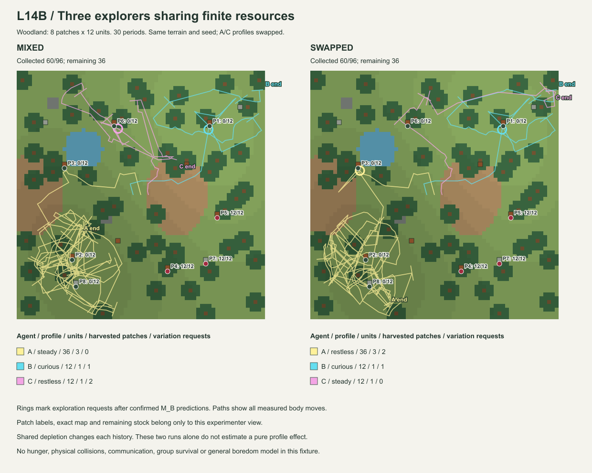

# Luanti L14B — shared resources and individual predictability demand

状態: ACCEPTANCE COMPLETE。実機3run・wire replay・全体テストPASS。2026-09-28。基準 `caea179c`。
[契約](../experiment-contracts/LUANTI_L14B_multi_resource_contract.md)。

## Scope

同じ自然地形を3個体が継続探索する。資源は8地点各12単位、30期間×16秒。
近景・表面ray・遠景、可食性の見本教示、初期の目印制御を共有し、観測・Experience・M_B・操作権限は個体別。
身体、所持品、資源を期間間で初期化しない。M_Bへの正式採用は1回まで。

今回の学習対象は「この取得条件で1回pickupすると取得でき、次の観測でも可食材料が手に届く範囲に残る」という
有限な正のパターン。最初の3操作が形成、後続2操作が検査。場所以外にも材料があると知っているわけではない。
同一地点での連続操作を含み、5地点の独立再現とは扱わない。反例を除いて成功だけを選び直さない。
T1 reviewには実際の可視材料数の差を使い、局所的な退屈でCore HやM_deltaを作らない。

## Meaning of predictability

採用後のF/F'は同じ凍結M_Bによる補助的な採取境界で、取得の成立と観測affordanceの継続を比較する。
予測一致なら差は0。別途、要求変化量と確認された予測どおりの結果との差を局所
`stimulation_difference`として記録し、感度による探索要求へ渡す。
これはCore E/H/θの再定義ではない。欠測・未実行・未知は予測可能性を増やさない。
採用後の反例では予測の使用を失効させるが、過去の採用・比較・観測は保持する。

## Validation record

主runと役割交換runは、同じ木立地形・seed `20260928`、各30期間。近場対照は草地・2地点各12単位・2期間。
合計62 World期間、186個体期間、11,904観測・11,904操作結果、144実pickupを保存した。
Worldと身体を止めずに終了し、個体ごとの操作数・SensorFrame数・受付済み記録数が一致する。

| run | 個体 / profile | 取得数 | 採取した地点数 | 歩行距離 | 予測比較数 | 探索要求数 |
| --- | --- | ---: | ---: | ---: | ---: | ---: |
| mixed | A / steady | 36 | 3 | 805.900 | 7 | 0 |
| mixed | B / curious | 12 | 1 | 187.971 | 7 | 1 |
| mixed | C / restless | 12 | 1 | 175.627 | 7 | 2 |
| swapped | A / restless | 36 | 3 | 734.728 | 7 | 2 |
| swapped | B / curious | 12 | 1 | 187.971 | 7 | 1 |
| swapped | C / steady | 12 | 1 | 129.142 | 7 | 0 |

距離はLuantiの実測node単位。両runとも60/96単位を取得、P4/P5/P7の36単位が残った。
主runでは結果的に5つの別地点を利用した。共有地点での減算競合は、近場2地点の対照で確認している。
3個体とも自分の3形成＋2検査から別々のM_Bを採用し、7比較の最後にaffordance消失の反例で使用が失効した。
後続の採取まで、初期観測制御が止まるわけではない。

### 成功中の探索要求

| run / 個体 | 取得時刻 | 観測された資源の残量（監査側のみ） | 最初の実身体作用 |
| --- | ---: | ---: | --- |
| mixed B | 22.505285秒 | 1 | 約+30度回転 |
| mixed C | 24.007712秒 | 4 | 約−15度回転 |
| mixed C | 25.260185秒 | 1 | 1 node移動 |
| swapped A | 24.259615秒 | 4 | 約−45度回転 |
| swapped A | 25.757628秒 | 1 | 約−15度回転 |
| swapped B | 22.513038秒 | 1 | 約+30度回転 |

各要求は、採用M_Bの予測が一致した履歴で局所loadが6に到達したもの。
資源枯渇による離脱ではなく、成果が続いていても別の観測を求める作用が発生した。
ただし、後で同じ地点へ戻って採取する場合があり、最終的な個体別取得数は両runで同じ。
探索要求が少ないほど／多いほど有利という結論にはしていない。



[SVG](LUANTI_L14B_paths.svg)。丸い輪は探索要求、線は実測身体軌跡。地図と残量は監査専用で、個体の入力ではない。
Aの南西部での反復は両runに残る。今回は採取予測の反復に限定した機構なので、成果のない探索ループ全般を
検出して脱出する機構が完成したとは言えない。

### 通信・資源・個体分離

近場対照の24単位はA=10 / B=7 / C=7として取得した。全在庫減算と個体別inventoryの総和が一致する。
Aだけが候補を採用し、B/Cは形成・検査中の反例でREJECTになった。共有Worldでも経験内容は同じとは限らない。

対照ではAの成功応答を身体適用前に捨て、同じ観測を再送して`new_frames=0`で回復した。
63番目の応答受渡しを750ms遅らせ、期間を越えた指令を期限切れとして処理した。
各身体作用の二重要求、古い指令の再注入、他個体への指令注入を検査した。
故障注入はcallback/consumer段であり、実ネットワーク切断ではない。

旧L14Aも実Luantiで再実行: 2期間・128観測、2地点各2単位を4回取得して枯渇。
応答消失・再送・旧指令・枯渇後再探索を含めてPASS。既存L14Aの過去3runも全体テストで再生する。

### 保存・再現

- accepted control: `l14b-16610fad9b35492e`
- accepted mixed: `l14b-0381821f5c40434d`
- accepted swapped: `l14b-c45b9c51cfb44e28`
- legacy regression: `l14a-9c285304f6494abe`
- [replay](../../tests/fixtures/luanti_l14b_replay.json.gz): 5,638,985 bytes
- SHA256: `b6aabe1a2008b3ad7463515b0c4a67c91c63fb71d140015209fff9e579f83145`

raw snapshotのSHA256とJSON一致、取得された観測・応答の全再生、関連実行ソースのSHA256を保存・検査した。
初期試行3件は除外記録として同梱する。最初の2件は教示の配置不備（他個体の像による遮蔽、起伏内への見本配置）
でsetup停止し修正した。3件目はWorldは完走したが、canonical tupleのJSON list化を厳密比較してexporterが失敗した。
これらを受入済みrunへ数えず、修正後に独立したWorldを再実行した。

```powershell
python -m integrations.luanti.tests.run_multi_resource --output integrations/luanti/output/l14b-main.json.gz
python -m integrations.luanti.tests.archive_multi_resource integrations/luanti/output/l14b-main.json.gz tests/fixtures/luanti_l14b_replay.json.gz --legacy integrations/luanti/output/l14b-legacy.json.gz
python -m unittest discover -s tests -v
```

アーカイブ手順の除外記録は今回のrawファイルに対応する。新規環境では同梱replayで再生できる。
Python専用試験は18件の合成/並行/分離試験と3件の実機記録試験。
専用21件PASS。全体は **820件実行 = 769 PASS + 51 intentional skip**、272.462秒。
全体ログは `integrations/luanti/output/l14b-full-tests.log`（ローカル監査用・git対象外）。

## Boundaries

事前の候補語彙・形成/検査予算・固定感度・行動consumerは実験者が与える。
未知の一般関係を自由発明する機構、身体的なSleep、反例後の再学習、樹種と資源分布の学習ではない。
探索要求は現在見える目印への有限試行であり、同じ領域から脱出する保証も効率向上の保証もない。
共有するのは資源減算。非物理ObjectRefの衝突、他者の意図・所有・通信・援助要請・模倣は扱わない。
飢餓・夜・死亡・集団の生存率は測っていない。

初期位置、通信到着順、共有資源の減少で各自の後続履歴が変わる。mixedとswappedの集計差を
感度だけの因果効果と断定しない。同一受理履歴の反実仮想選択はPythonの独立試験で確認する。
観測器の呼出し数、取得時刻、World地形・残量の非流入はreplay checkerで検査する。
