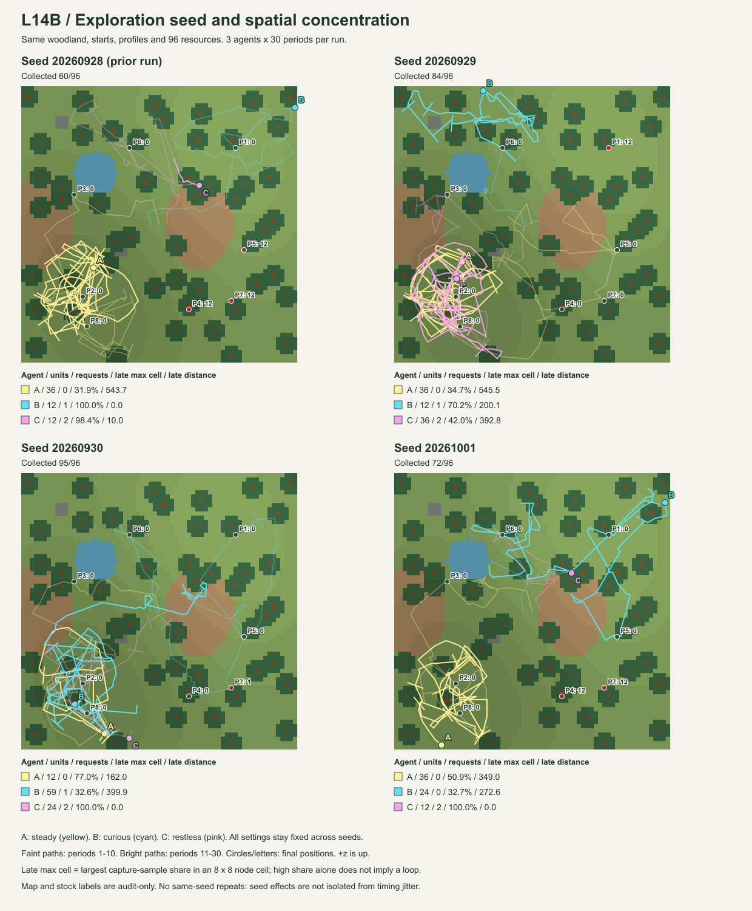

# Luanti L14B — 同じ環境で探索seedを変える

状態: ACCEPTANCE COMPLETE。実Luanti追加3run・wire再生・全体テストPASS。2026-09-28。基準 `faf1fc42`。
[L14B契約](../experiment-contracts/LUANTI_L14B_multi_resource_contract.md)と
[元の受入記録](LUANTI_L14B_multi_resource_evidence.md)を引き継ぐ。

## 比較範囲

保存済みmixed runのseed `20260928` に対し、`20260929 / 20260930 / 20261001` を事前指定して各1回実行した。
追加3runはすべて実Luanti。各runは新しいWorld・Runtime・個体履歴から始め、途中で見つけても30期間まで続ける。
実行間でWorld・経験・M_Bは引き継がず、同一runの期間間では身体・資源・所持品を初期化しない。

固定条件は、A/B/C=steady/curious/restless、同じ開始位置、自然木立地形、8地点各12単位、昼間、30期間×16秒。
**変えたのは探索seed。植生seed719や地形・食料配置は変更していない。**
各runの地形readback、開始身体、profile、資源初期配置の一致を機械検査した。
選択・学習・M_B失効・探索要求の規則は変更せず、runnerへseed引数を追加しただけである。

このseedは、取得した面特徴の候補から選ぶ処理に使われる。未知の目的地を与えるものではない。
3個体は同じseedを使用し、同じ候補数・選択回数なら選択indexが一致し得る。
個体別の独立乱数streamの効果は、今回の検査範囲外。

## 結果

**取得量と利用地点は変わったが、後半に南西へ集まる偏りは残った。**

| 探索seed | A / steady | B / curious | C / restless | 合計 / 96 | 残った資源 |
| --- | ---: | ---: | ---: | ---: | --- |
| 20260928 | 36 | 12 | 12 | 60 | P4=12、P5=12、P7=12 |
| 20260929 | 36 | 12 | 36 | 84 | P1=12 |
| 20260930 | 12 | 59 | 24 | 95 | P7=1 |
| 20261001 | 36 | 24 | 12 | 72 | P4=12、P7=12 |

追加3runは90 World期間・270個体期間、17,280観測と17,280操作結果、251実pickup。
比較元を含む4runは120 World期間・360個体期間、23,040観測と23,040操作結果、311実pickup。
runごとの取得＋残量は96に一致。保存列から各個体の状態と身体作用を再生検査した。

| seed | Aが採取 | Bが採取 | Cが採取 | 全個体の採取数：期間1–10 / 11–20 / 21–30 |
| --- | --- | --- | --- | --- |
| 20260928 | P2、P3、P8 | P1 | P6 | 60 / 0 / 0 |
| 20260929 | P4、P5、P7 | P6 | P2、P3、P8 | 83 / 1 / 0 |
| 20260930 | P3 | P1、P4、P5、P6、P7 | P2、P8 | 95 / 0 / 0 |
| 20261001 | P2、P3、P8 | P1、P5 | P6 | 48 / 12 / 12 |

P1〜P8は同じ座標にある監査用の地点番号。上の表は見えた地点ではなく、実際に採取した地点。
例えばseed20260930のAにはP6/P8も観測されたが、採取はP3だけであった。今回の4runでは、各地点の実pickupはそれぞれ1個体が行っている。
seed20261001のBは後半に2地点を採取した。他の3runの最終10期間は採取ゼロ。後半の改善を一般則にはできない。

全12個体runで各自のM_B採用と、その後の反例による使用失効を確認した。
探索要求はseed20260928/29/30でA/B/C=0/1/2、20261001では0/0/2。
最後のBは予測比較6件（確認5・反例1）、局所loadの最大値4で、閾値6に到達していない。
同じprofileでも、確認の数と連続性を満たさなければ探索要求は出ない。
Bの要求時刻も20260928の22.505285秒に対し、20260929は152.023056秒だった。



[SVG](LUANTI_L14B_seed_paths.svg)。薄い線は最初の10期間、濃い線は後半20期間。丸と個体名は終了位置。

## 集中と停止の区別

全1920取得sample/個体と、後半20期間の1280sampleを別集計する。
8×8 nodeの区画番号を `floor(x/8), floor(z/8)` とし、最大の区画に含まれるsample比率を「最大区画比率」とする。
これは便宜的な空間集計であり、個体の地図やExperience支持数ではない。区画の大きさ・位置への依存がある。

実測移動距離、移動した操作数、位置不変の操作数、結果status、制御理由を併記する。
位置不変には待機・回転・pickupも含まれるので、位置不変だけを失敗とはしない。
通行不能の監査理由も、World境界と地形上の支持不足・障害を分ける。
正確な位置、地図、P1〜P8、残量、障害監査は集計側だけで使い、制御へ戻していない。

| seed / 個体 | 後半の最大区画比率 | 後半の移動距離 | 後半のblocked | 後半のwaited |
| --- | ---: | ---: | ---: | ---: |
| 20260928 / A | 31.9% | 543.657 | 1 | 339 |
| 20260928 / B | 100.0% | 0.000 | 160 | 1120 |
| 20260928 / C | 98.4% | 10.000 | 155 | 1108 |
| 20260929 / A | 34.7% | 545.485 | 4 | 319 |
| 20260929 / B | 70.2% | 200.142 | 93 | 831 |
| 20260929 / C | 42.0% | 392.828 | 2 | 568 |
| 20260930 / A | 77.0% | 162.000 | 0 | 897 |
| 20260930 / B | 32.6% | 399.900 | 2 | 540 |
| 20260930 / C | 100.0% | 0.000 | 0 | 1106 |
| 20261001 / A | 50.9% | 349.000 | 75 | 626 |
| 20261001 / B | 32.7% | 272.627 | 70 | 711 |
| 20261001 / C | 100.0% | 0.000 | 158 | 1101 |

**Aは全4seedで、後半1280取得sampleの位置がすべて `x<0, z<0` の南西域にあった。**
20260929ではAが東側のP4/P5/P7を採取してから南西へ移り、20260930ではBも後半sampleの79.3%が南西域だった。
特定seedの同じ初期進路だけで説明するには足りず、地形と現行の目印制御の組合せが残す偏りを疑う材料となる。原因の分離には別対照が必要。

停滞の内訳も一様ではない。20260928のBは後半の境界blockedが160回、Cは地形の支持不足・障害によるblockedが155回。
一方20260930のCは後半のblockedが0回でも移動ゼロで、160回の回転、151回の `landmark_lost`、910回の `landmark_goal_budget` が記録された。
「移動が阻まれる」「粗い特徴を再対応できない」「選択予算を使い切って待つ」を、同じ停滞量の中で区別できる。

実行時刻の揺らぎも保存した。全期間・全個体の結果statusは次のとおり。

| seed | expired | stale | stopped |
| --- | ---: | ---: | ---: |
| 20260928 | 0 | 1 | 0 |
| 20260929 | 0 | 0 | 0 |
| 20260930 | 4 | 32 | 5 |
| 20261001 | 36 | 16 | 3 |

## 何を確認でき、何をまだ言えないか

前回とseed20260929の初期分岐を調べると、Aのsample8、Bのsample6、Cのsample5では、
同じ実測位置・yaw・目印観測から、回転指令がそれぞれ `+45→−45`、`+45→−45`、`+20→−45` へ変わっている。
初手だけでは両seedの選択indexは同じ1だった。seedが違えば、毎回すべての選択が変わるわけでもない。

ただし、同seedを繰り返す対照は追加していない。World時計は止まらずHTTP実行時刻も揺らぐため、
最終軌跡・取得数の差をseedだけの純粋な因果効果と断定しない。
同じ保存HTTP列の再生一致は検査するが、新しい実World run全体の完全決定性とは別である。
この4例からseedの母集団分布、profileの優劣、集団の生存性を推定しない。

採用M_Bは正の採取affordanceの継続に限定され、反例後の再採用はしない。
予測一致の差は0のまま、探索要求は別の局所 `stimulation_difference` から生じる。
成果のない移動反復や障害での停滞を全般的に検出・回避する学習を追加したわけではない。

## 再実行と保存

```powershell
python -m integrations.luanti.tests.run_multi_resource_seeds --output integrations/luanti/output/l14b-seeds-new.json.gz
python -m integrations.luanti.tests.archive_multi_resource_seeds integrations/luanti/output/l14b-seeds-new.json.gz tests/fixtures/luanti_l14b_seed_replay.json.gz tests/fixtures/luanti_l14b_seed_analysis.json
python -m integrations.luanti.tests.render_multi_resource_seeds tests/fixtures/luanti_l14b_seed_replay.json.gz docs/experiment-evidence/LUANTI_L14B_seed_paths.svg
python -m unittest discover -s tests -p test_multi_resource_seeds.py -v
```

runnerは既存出力の上書きを拒否し、実行前に全caseと生成側source hashを保存する。
部分失敗はそのcase・理由を残して停止し、都合のよいseedへ取り替えない。
保存する生のsnapshotのbyte hashとJSON内容を照合し、未完了panelや固定条件の違いを拒否する。
比較元の旧fixtureは複製せず、そのfile hashとrun IDで参照する。

| 追加seed | 実Luanti run ID |
| --- | --- |
| 20260929 | `l14b-9e505aea2f9245dc` |
| 20260930 | `l14b-acc31a68f5ed4ba7` |
| 20261001 | `l14b-490093b6584e4620` |

全3caseは開始前の `2026-09-27T23:18:50.483181+00:00` に保存した。除外run・seed差替えなし。

[完全再生fixture](../../tests/fixtures/luanti_l14b_seed_replay.json.gz)は追加3runの全観測・応答・結果・監査を収録する。
圧縮サイズ 8,262,100 bytes、SHA-256 `c9107b87660ca0cf5e469a0a7acab5073d9a947961aafc6924a328a247a767ca`。

[集計JSON](../../tests/fixtures/luanti_l14b_seed_analysis.json)には4run全個体の区画分布・可視地点・採取地点・操作理由を保存する。
元fixtureのSHA-256は `b6aabe1a2008b3ad7463515b0c4a67c91c63fb71d140015209fff9e579f83145`。

追加の単体検査は、負座標のfloor、集中と移動量の分離、空の測定を0%としないこと、期間境界と可視/採取の分離。
実記録では全3seedのHTTP列・最終Runtimeの一致、既存の身体/権限/資源保存、固定条件、集計の再計算を検査する。

検証結果: 追加6テストPASS（全体テスト内）。全体826件実行 = **775 PASS + 51 intentional skip**、557.346秒。
`python -m unittest discover -s tests -v` を実行した。既存L14B・L14Aなどの保存記録再生を含む。
今回新たに実Luantiを起動したのは上記3seedの30期間runであり、旧OBS/SOC等の実機を再実行したとは扱わない。
全体ログはローカルの `integrations/luanti/output/l14b-seeds-full-tests.log`。
